# Auth Flow — TeslaPrimeCapital

**Project:** TeslaPrimeCapital — Enterprise Investment Platform  
**Phase:** 2 — Technical Architecture  
**Version:** 1.0.0  
**Status:** Draft  
**Tech Stack:** Next.js · TypeScript · JWT · bcrypt/argon2id · TOTP 2FA · Redis · PostgreSQL  

---

## Table of Contents

1. [Authentication Overview](#1-authentication-overview)
2. [Registration Flow](#2-registration-flow)
3. [Login Flow](#3-login-flow)
4. [Token Lifecycle](#4-token-lifecycle)
5. [2FA / TOTP Flow](#5-2fa--totp-flow)
6. [Password Reset Flow](#6-password-reset-flow)
7. [Email Verification Flow](#7-email-verification-flow)
8. [Session Management](#8-session-management)
9. [Role-Based Access Control](#9-role-based-access-control)
10. [KYC Gate](#10-kyc-gate)
11. [Demo vs Live Mode Context](#11-demo-vs-live-mode-context)
12. [Security Measures](#12-security-measures)

---

## 1. Authentication Overview

TeslaPrimeCapital implements a **JWT-based stateless authentication** system with **dual-token architecture**: a short-lived access token and a long-lived refresh token with rotation. This design separates short-term API authorization from long-term session management, minimising the blast radius of token theft while preserving a seamless user experience.

### 1.1 Access Token

| Property | Value |
|---|---|
| **Type** | Signed JWT (HS256) |
| **Lifetime** | 15 minutes |
| **Storage** | JavaScript module-level variable (in-memory only) |
| **Transport** | `Authorization: Bearer <token>` header |
| **Claims** | `sub` (user ID), `role`, `kycLevel`, `mode`, `iat`, `exp` |

The access token is **never** stored in `localStorage`, `sessionStorage`, cookies, or `IndexedDB`. It lives exclusively in a closure-scoped JS variable and is lost on every page refresh. This eliminates XSS-based token exfiltration vectors.

### 1.2 Refresh Token

| Property | Value |
|---|---|
| **Type** | Signed JWT (HS256) |
| **Lifetime** | 7 days |
| **Storage** | HTTP-only, `Secure`, `SameSite=Strict` cookie |
| **Transport** | Automatically attached by the browser |
| **Claims** | `sub`, `jti`, `sessionVersion`, `iat`, `exp` |

The refresh token is the **only** persistent authentication artifact. Its HTTP-only flag prevents JavaScript access; `SameSite=Strict` prevents cross-site transmission. Each use triggers **token rotation** — the old token is invalidated and a new one is issued.

### 1.3 Design Principles

- **Stateless API layer** — the backend validates JWTs on every request; no server-side session lookup is needed for normal API calls.
- **Redis-backed session state** — refresh token `jti` values, session versions, lockout counters, and device metadata live in Redis for sub-millisecond lookups.
- **Zero Trust** — every request is authenticated and authorised; the reverse proxy is not a substitute for application-layer auth.
- **Defence in depth** — rate limiting, CSRF tokens, CSP headers, input validation (Zod), and audit logging operate as independent security layers.

---

## 2. Registration Flow

### 2.1 Sequence Diagram

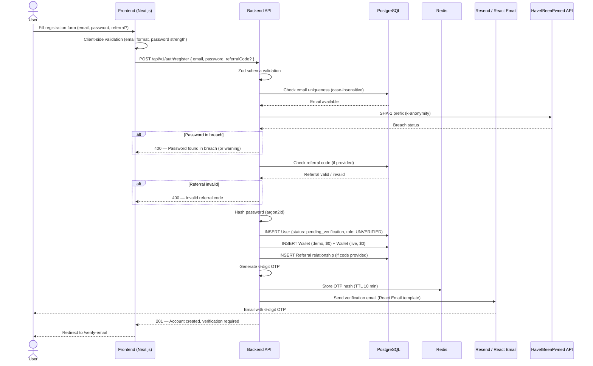

### 2.2 Validation Rules

| Field | Rule |
|---|---|
| **Email** | RFC 5322 format, max 254 chars, case-insensitive uniqueness |
| **Password** | Min 8 / max 128 chars; ≥ 1 uppercase, ≥ 1 lowercase, ≥ 1 digit, ≥ 1 special char |
| **Referral Code** | Optional; 8-char alphanumeric; must belong to an active user |
| **Breach Check** | HaveIBeenPwned k-anonymity API; configurable reject/warn via `REJECT_BREACHED_PASSWORDS` |

### 2.3 Post-Registration State

- Account status: `pending_verification`
- Role: `UNVERIFIED` (can only verify email and browse public pages)
- Session: none — no tokens are issued until email is verified
- Wallets: demo and live wallets created with zero balances
- Referral: relationship recorded; commissions deferred until first qualifying action

---

## 3. Login Flow

### 3.1 Sequence Diagram

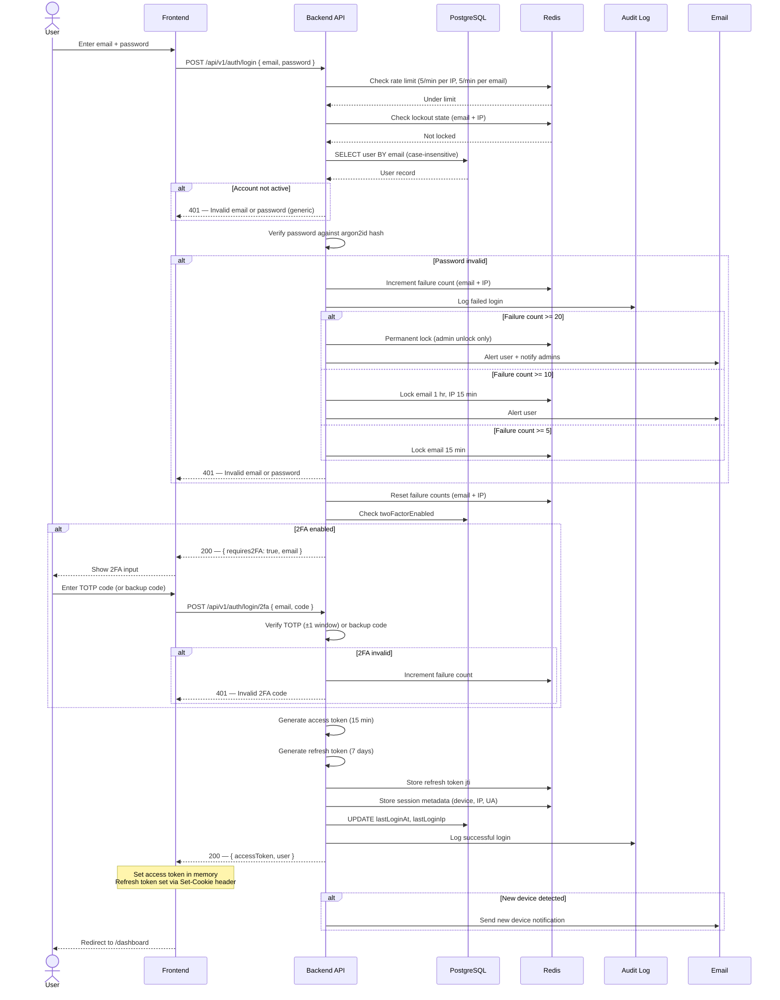

### 3.2 Error Response Policy

All login failures return the **same** generic message: `"Invalid email or password."` The only distinguishable response is the 2FA challenge (`requires2FA: true`), which the frontend needs to render the correct UI. This prevents account enumeration.

### 3.3 Progressive Lockout Tiers

| Tier | Failed Attempts | Email Lock | IP Lock | Notification |
|---|---|---|---|---|
| 1 | 5 | 15 min | — | Audit log only |
| 2 | 10 | 1 hour | 15 min | Email to user |
| 3 | 20 | Permanent (admin unlock) | 1 hour | Email to user + alert admins |

Counters reset on successful login or after lockout TTL expiry.

---

## 4. Token Lifecycle

### 4.1 Access Token

```
┌──────────────────────────────────────────────────────┐
│  ACCESS TOKEN (JWT, HS256)                            │
│                                                      │
│  Header:  { "alg": "HS256", "typ": "JWT" }           │
│  Payload: {                                           │
│    "sub": "usr_abc123",                               │
│    "role": "USER",                                    │
│    "kycLevel": 1,                                     │
│    "mode": "live",                                    │
│    "iat": 1700000000,                                 │
│    "exp": 1700000900    ← 15 minutes                  │
│  }                                                   │
│  Storage: JS in-memory variable                       │
│  Transport: Authorization: Bearer <token>             │
└──────────────────────────────────────────────────────┘
```

### 4.2 Refresh Token

```
┌──────────────────────────────────────────────────────┐
│  REFRESH TOKEN (JWT, HS256)                           │
│                                                      │
│  Header:  { "alg": "HS256", "typ": "JWT" }           │
│  Payload: {                                           │
│    "sub": "usr_abc123",                               │
│    "jti": "rt_x9f2k8m1",                              │
│    "sessionVersion": 3,                               │
│    "iat": 1700000000,                                 │
│    "exp": 1700604800    ← 7 days                      │
│  }                                                   │
│  Storage: HTTP-only, Secure, SameSite=Strict cookie   │
│  Transport: Automatically by browser                  │
└──────────────────────────────────────────────────────┘
```

### 4.3 Token Refresh Flow

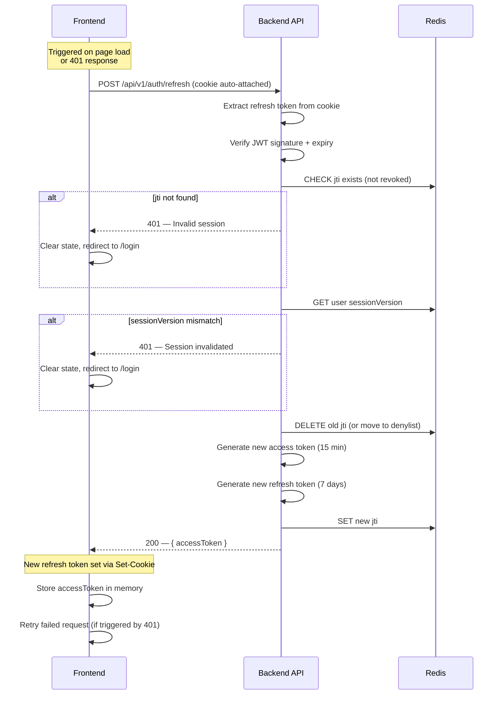

### 4.4 Token Blacklist on Logout

On logout, the refresh token's `jti` is removed from Redis (or added to a short-TTL denylist equal to the token's remaining validity). The access token is discarded from memory. Since the access token expires in 15 minutes, no server-side blacklist is maintained for it — the window of misuse is negligible.

**Logout all devices** is implemented by incrementing the user's `sessionVersion` in Redis. Every subsequent refresh attempt fails because the token's embedded version no longer matches the stored version.

### 4.5 Concurrent Refresh Handling

When multiple browser tabs attempt to refresh simultaneously, a **Redis-based lock** ensures only one refresh proceeds at a time. The frontend also implements a client-side mutex — a single in-flight refresh promise is shared across all tabs via a BroadcastChannel or shared state.

---

## 5. 2FA / TOTP Flow

### 5.1 Setup Sequence

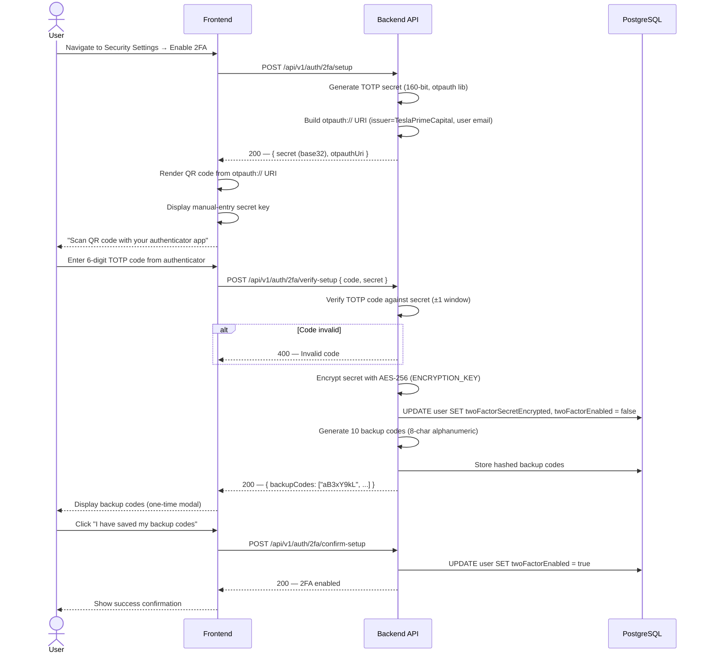

### 5.2 Verification on Login

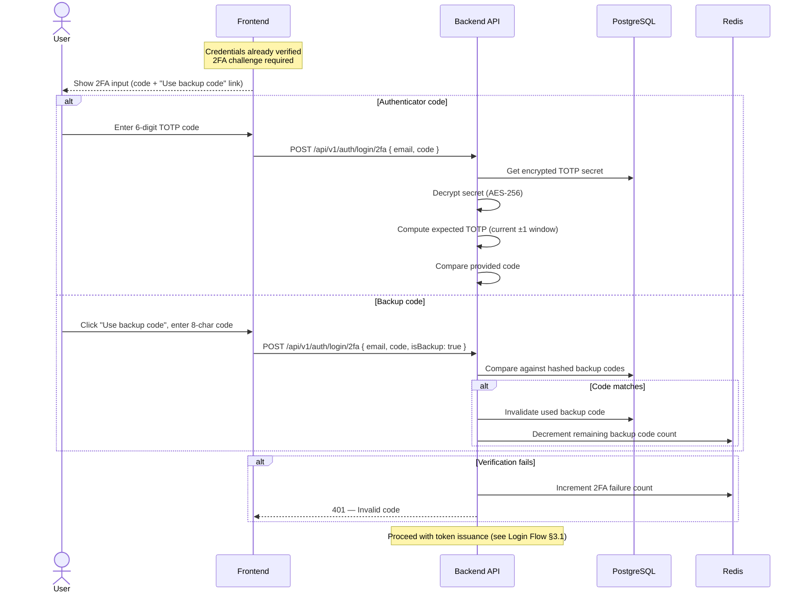

### 5.3 Disable 2FA Flow

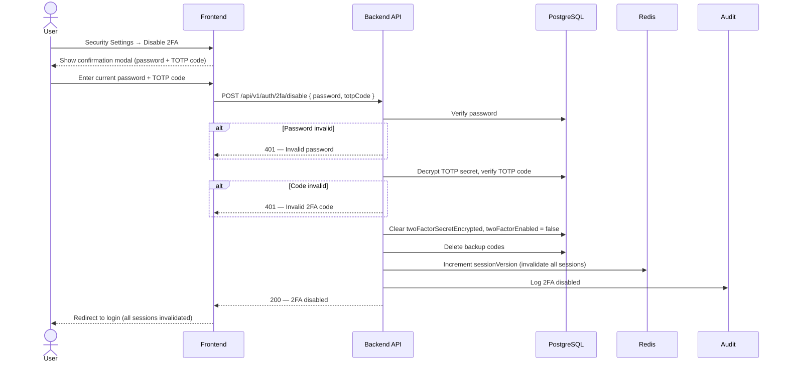

### 5.4 2FA for Sensitive Operations

Operations such as withdrawals, email changes, and password changes require a **fresh 2FA verification** — not the cached login state. The frontend shows a 2FA modal, the code is verified via a dedicated endpoint, and a short-lived (5 min) 2FA verification token is returned. This token is included in the subsequent operation request.

### 5.5 TOTP Time Window

The verifier accepts codes from the **current** 30-second window and the **immediately preceding and following** windows (±1, covering 90 seconds total). This accounts for clock drift without significantly weakening security.

---

## 6. Password Reset Flow

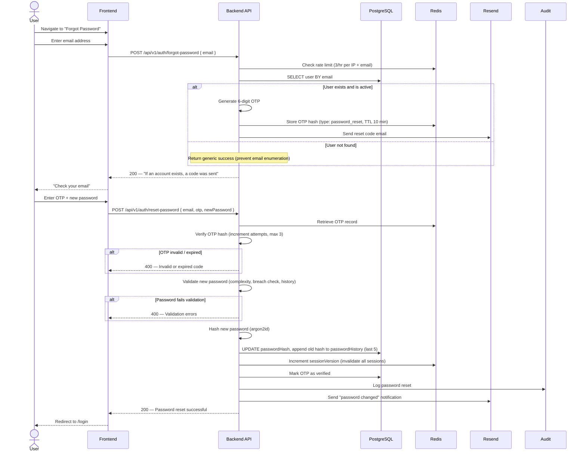

### 6.1 Session Invalidation on Reset

All existing sessions are immediately invalidated by incrementing the user's `sessionVersion` in Redis. Every refresh token carries the version at issuance time; a mismatch forces re-authentication.

---

## 7. Email Verification Flow

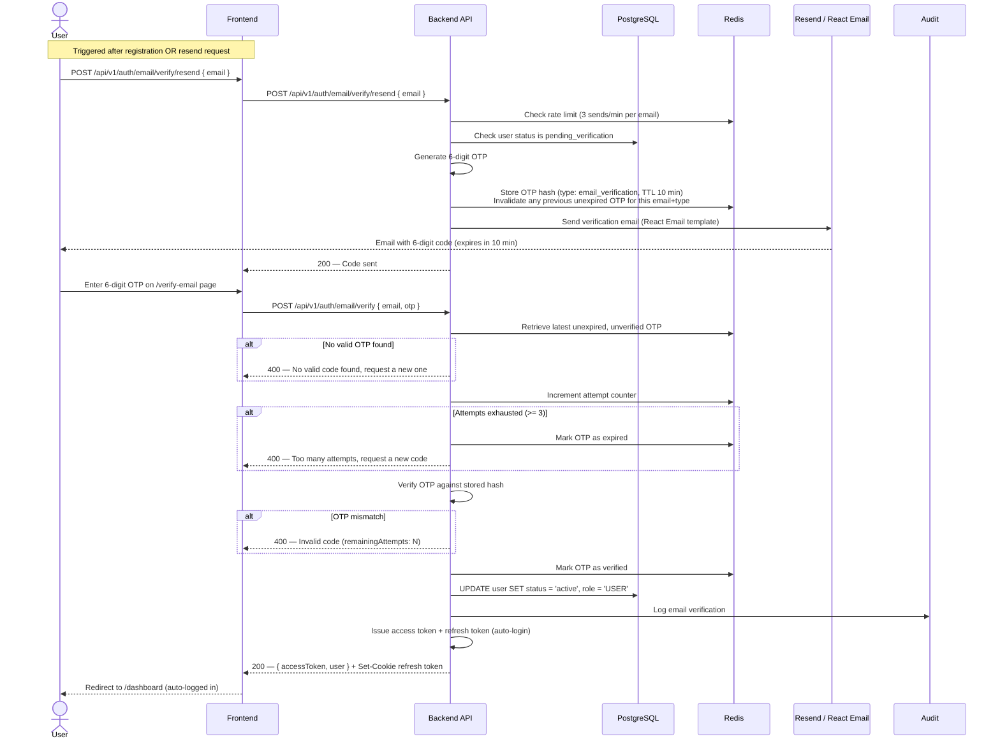

### 7.1 OTP Constraints

| Constraint | Value |
|---|---|
| **Code format** | 6 digits (000000–999999) |
| **Expiry** | 10 minutes |
| **Max attempts** | 3 per OTP |
| **Send rate limit** | 3 per minute per email |
| **Verify rate limit** | 10 per minute per email |
| **Single active OTP** | New OTP invalidates previous unexpired OTPs for same email+type |

---

## 8. Session Management

### 8.1 Redis Session Store

Session metadata is stored in Redis with the following structure:

```
session:{jti} → {
  userId: "usr_abc123",
  deviceFingerprint: "fp_a1b2c3d4",
  ipAddress: "203.0.113.42",
  userAgent: "Mozilla/5.0 ...",
  createdAt: 1700000000,
  lastActivityAt: 1700003600,
  mode: "live"
}
TTL: 7 days (matches refresh token expiry)
```

A user-level key tracks the session version for bulk invalidation:

```
sessionVersion:{userId} → 3
TTL: 30 days
```

### 8.2 Session Management Sequence

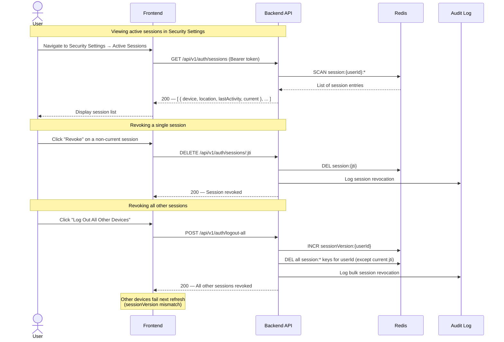

### 8.3 Concurrent Session Limits

The platform enforces a maximum of **5 concurrent active sessions** per user. When a 6th login is attempted, the oldest session (by `lastActivityAt`) is automatically revoked. The user receives a notification indicating which device was logged out.

### 8.4 Session Invalidation Triggers

| Event | Mechanism |
|---|---|
| Password change | Increment `sessionVersion` |
| 2FA enable / disable | Increment `sessionVersion` |
| Admin ban / suspend | Increment `sessionVersion` |
| User "logout all" | Increment `sessionVersion` |
| Single device logout | Delete specific `jti` from Redis |
| Session TTL expiry | Redis auto-expires key (7 days) |

### 8.5 Device Fingerprinting

On each login and token refresh, the frontend generates a device fingerprint using:

- `navigator.userAgent` string
- Screen resolution and colour depth
- Timezone offset
- Canvas / WebGL rendering hash
- Installed plugins (if available)

The fingerprint is sent via the `X-Device-Fingerprint` custom header. When a login originates from a **previously unseen** fingerprint (not associated with the user in the past 30 days), the backend sends a "new device login" email notification containing the timestamp, approximate location, device type, and browser name.

A rolling **90-day device history** is maintained per user. Devices not seen in 90 days are pruned from the history.

---

## 9. Role-Based Access Control

### 9.1 Role Hierarchy

```
SuperAdmin (Level 6)
├── Admin (Level 5)
│   ├── KYC Officer (Level 4)
│   └── Support Agent (Level 3)
│       └── User / Investor (Level 2)
│           └── Unverified User (Level 1)
```

Higher roles **inherit all permissions** of the roles below them. A SuperAdmin possesses every permission available to all other roles, plus exclusive permissions (role management, fee management, wallet adjustment, KYC override, impersonation).

### 9.2 Role Assignment & Enforcement

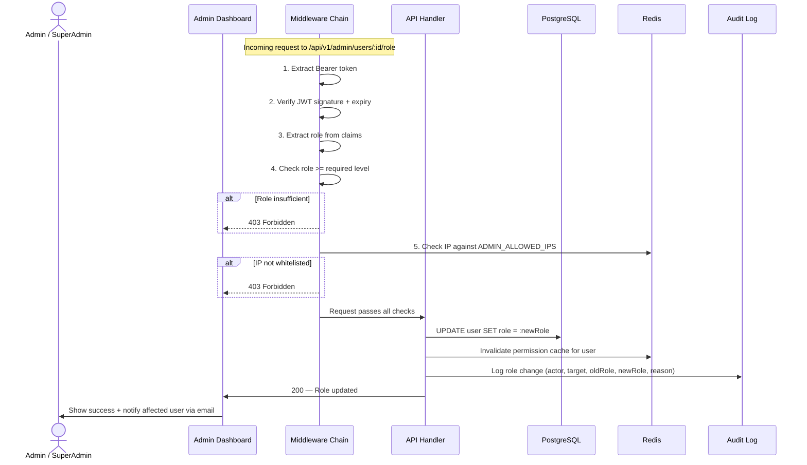

### 9.3 Middleware Chain for Route Protection

Every API route passes through the following middleware chain:

```
Request → [Rate Limiter] → [CORS] → [CSRF Token] → [JWT Verify] → [Role Check] → [KYC Check] → [Mode Context] → Handler
```

| Layer | Responsibility |
|---|---|
| **Rate Limiter** | Redis sliding-window counter; returns 429 with `Retry-After` |
| **CORS** | Validate `Origin` against whitelist; set `Access-Control-*` headers |
| **CSRF Token** | Validate `X-CSRF-Token` on POST/PUT/PATCH/DELETE (SSR-injected) |
| **JWT Verify** | Verify signature, expiry, and claims; attach `user` to request |
| **Role Check** | Compare user's role against route's required minimum role |
| **KYC Check** | Verify user's KYC level meets the endpoint's requirement (if any) |
| **Mode Context** | Resolve `demo` or `live` from request header / query param / default |
| **Handler** | Execute business logic |

### 9.4 Permission Inheritance Model

Permissions are resolved at **middleware level** in a single check. The middleware maintains a permission map keyed by role, where each role's entry is the union of its own permissions plus all permissions from roles below it in the hierarchy. This map is cached in Redis and invalidated when roles or permissions change.

```
// Conceptual permission resolution
const ROLE_PERMISSIONS = {
  SUPER_ADMIN:  { /* all 36 permissions */ },
  ADMIN:        { /* inherits KYC_OFFICER + SUPPORT_AGENT + USER, plus admin ops */ },
  KYC_OFFICER:  { /* inherits SUPPORT_AGENT, plus KYC review */ },
  SUPPORT_AGENT:{ /* inherits USER, plus ticket management */ },
  USER:         { /* own-profile, own-wallet, deposit, invest, withdraw, referral */ },
  UNVERIFIED:   { /* email verification only */ },
};
```

### 9.5 Role Transition Rules

| Transition | Trigger | Actor | Audit |
|---|---|---|---|
| UNVERIFIED → USER | Email verified | System (auto) | Yes |
| USER → KYC_OFFICER | Promotion | SuperAdmin / Admin | Yes + training required |
| USER → SUPPORT_AGENT | Promotion | SuperAdmin / Admin | Yes + training required |
| Any → BANNED | Policy violation | Admin / SuperAdmin | Yes + email notification |
| Any role → USER | Demotion | SuperAdmin | Yes + email notification |

---

## 10. KYC Gate

### 10.1 KYC Levels and Restrictions

| KYC Level | Deposit Limit | Withdrawal Allowed | Plan Tiers Available |
|---|---|---|---|
| **Level 0** (Unverified) | None (no deposits) | No | None |
| **Level 1** (Basic) | $5,000 per transaction | Up to $1,000/day | Starter, Bronze |
| **Level 2** (Enhanced) | $50,000 per transaction | Up to $25,000/day | All tiers (including Gold, Platinum) |

### 10.2 KYC-Gated Operations

The following operations require minimum KYC levels, enforced in middleware:

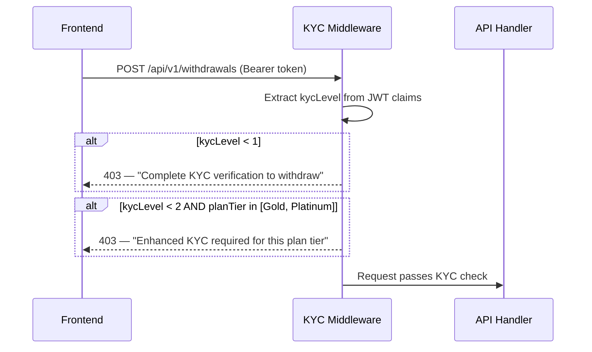

| Operation | Min KYC Level | Notes |
|---|---|---|
| Create deposit | Level 1 | Crypto and gift card deposits |
| Request withdrawal | Level 1 | 21% fee applied |
| Withdraw > $1,000/day | Level 2 | Daily cumulative check |
| Activate Gold / Platinum plan | Level 2 | Higher-return plan tiers |
| Refer users and earn commissions | Level 1 | Commissions credited to live wallet |

### 10.3 KYC Status in JWT

The access token embeds the user's `kycLevel` at the time of issuance. If a user's KYC is approved during an active session, the token will reflect the new level on the next refresh (within 15 minutes max). For immediate effect, the frontend can call the refresh endpoint after a KYC approval notification.

---

## 11. Demo vs Live Mode Context

### 11.1 Architecture Principle

Authentication is **shared** between Demo and Live modes — a single login grants access to both environments. The operating mode is a **per-request context**, not a session-level setting. This simplifies the auth model while ensuring financial isolation.

### 11.2 Mode Resolution

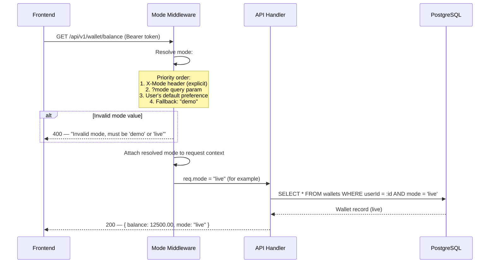

### 11.3 Wallet / Account Isolation

| Dimension | Demo Mode | Live Mode |
|---|---|---|
| **Wallet** | Separate `Wallet` row (`mode = 'demo'`) | Separate `Wallet` row (`mode = 'live'`) |
| **Transactions** | Isolated transaction history | Isolated transaction history |
| **Investments** | Simulated plans, virtual returns | Real funds, actual returns |
| **Withdrawals** | Not permitted (virtual funds) | Permitted (KYC-gated, 21% fee) |
| **KYC** | Not required | Required for deposits and withdrawals |
| **Admin view** | Admins can toggle to see demo data | Default view for financial operations |

The database enforces isolation through the `mode` column on `Wallet`, `Transaction`, `Investment`, and related tables. Every query includes a `WHERE mode = :resolvedMode` clause, preventing cross-mode data leakage.

### 11.4 Mode Switching

The frontend provides a prominent mode toggle in the navigation bar. Switching modes does **not** require re-authentication — it simply changes the `X-Mode` header sent with subsequent API requests. The UI visually distinguishes the two modes (e.g., a "DEMO" badge with a distinct colour scheme) to prevent users from accidentally operating in the wrong context.

---

## 12. Security Measures

### 12.1 Brute Force Protection

| Layer | Mechanism |
|---|---|
| **Rate limiting** | 5 login requests/min per IP + per email; 20/hr |
| **Progressive lockout** | 5 fails → 15 min; 10 fails → 1 hr; 20 fails → permanent (admin unlock) |
| **Generic errors** | "Invalid email or password" for all failures (prevents enumeration) |
| **IP + email tracking** | Independent counters in Redis with TTL auto-expiry |

### 12.2 Account Lockout & Suspicious Activity Detection

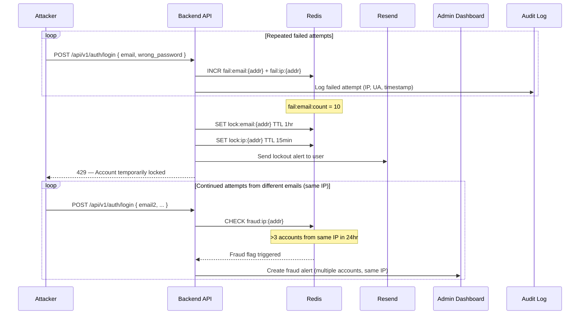

### 12.3 Fraud Detection Rules

| Rule | Threshold | Action |
|---|---|---|
| Multiple accounts from same IP | >3 registrations / 24 hr | Admin alert |
| Rapid deposit/withdrawal | >5 cycles / 1 hr | Admin alert |
| Unusual referral pattern | >10 referrals / 24 hr | Admin alert |
| KYC document reuse | Perceptual hash match | Admin alert |
| Geographic anomaly | Sudden location change | Soft alert on next login |
| Gift card fraud indicators | Multiple rejections, same brand | Admin alert |

### 12.4 CORS Configuration

```
Access-Control-Allow-Origin:  https://teslaprimecapital.com (production)
Access-Control-Allow-Methods: GET, POST, PUT, PATCH, DELETE, OPTIONS
Access-Control-Allow-Headers: Content-Type, Authorization, X-CSRF-Token, X-Device-Fingerprint, X-Mode
Access-Control-Allow-Credentials: true
Access-Control-Max-Age: 86400
```

In development, `localhost:3000` is added to the allowed origins. The CORS middleware rejects all requests from unlisted origins.

### 12.5 CSRF Protection

| Mechanism | Detail |
|---|---|
| **SameSite=Strict** | All cookies (including refresh token) use `SameSite=Strict` |
| **CSRF token** | Server-generated, SSR-injected via `<meta>` tag or hidden field |
| **Header validation** | State-changing requests must include `X-CSRF-Token` header |
| **Bearer exemption** | Requests using `Authorization: Bearer` are exempt (token not auto-attached) |

### 12.6 XSS Protection

| Mechanism | Detail |
|---|---|
| **CSP header** | `script-src 'self' 'nonce-{NONCE}'; style-src 'self' 'unsafe-inline'; img-src 'self' data: https://res.cloudinary.com; frame-ancestors 'none'` |
| **React auto-encoding** | JSX rendering automatically encodes all output |
| **DOMPurify** | Required for any rich-text rendering (support tickets) |
| **Access token in memory** | Even if XSS occurs, the token cannot be exfiltrated to persistent storage |

### 12.7 IP Whitelisting for Admin Routes

Admin API endpoints (`/api/v1/admin/*`) enforce an additional IP allowlist check:

```typescript
// Middleware pseudocode
const adminAllowedIPs = (process.env.ADMIN_ALLOWED_IPS || '').split(',');
// Extracted from X-Forwarded-For (set by trusted reverse proxy)
const clientIP = req.headers['x-forwarded-for']?.split(',')[0] || req.ip;

if (!adminAllowedIPs.includes(clientIP)) {
  return res.status(403).json({ error: 'Access denied' });
}
```

The `ADMIN_ALLOWED_IPS` environment variable accepts a comma-separated list of IPv4/IPv6 addresses. If the platform is accessed through a CDN or reverse proxy, the real client IP is extracted from the `X-Forwarded-For` header.

### 12.8 Security Headers

| Header | Value | Purpose |
|---|---|---|
| `Content-Security-Policy` | Per-request nonce for scripts | XSS prevention |
| `X-Frame-Options` | `DENY` | Clickjacking prevention |
| `X-Content-Type-Options` | `nosniff` | MIME sniffing prevention |
| `Strict-Transport-Security` | `max-age=31536000; includeSubDomains; preload` | Force HTTPS |
| `Referrer-Policy` | `strict-origin-when-cross-origin` | Prevent URL leakage |
| `Permissions-Policy` | `camera=(), microphone=(), geolocation=()` | Disable unused browser features |

### 12.9 Audit Logging on Auth Events

Every authentication-related event produces an immutable audit log entry:

| Event | Severity | Data Captured |
|---|---|---|
| Successful login | Info | userId, IP, device fingerprint, UA |
| Failed login | Warning | email (masked), IP, UA, failure count |
| Account lockout | High | email, IP, lockout tier, failure count |
| Account unlock | Medium | actorId (admin), targetUserId, reason |
| 2FA enabled | Info | userId |
| 2FA disabled | High | userId, actorId (self), IP |
| 2FA verification failure | Warning | userId, IP |
| Password change | Info | userId, IP |
| Password reset | High | userId, IP |
| Session revocation | Info | userId, jti, actorId |
| New device login | Medium | userId, device fingerprint, IP, location |

Audit logs are **append-only** — no API endpoint or admin action can modify or delete entries. The database role for the application has `INSERT` and `SELECT` only on the audit table. Retention period: 2 years.

---

## Appendix A: API Endpoint Summary

| Method | Endpoint | Auth | Description |
|---|---|---|---|
| POST | `/api/v1/auth/register` | Public | Register new account |
| POST | `/api/v1/auth/login` | Public | Login with email + password |
| POST | `/api/v1/auth/login/2fa` | Public | Verify 2FA during login |
| POST | `/api/v1/auth/refresh` | Refresh cookie | Rotate tokens |
| POST | `/api/v1/auth/logout` | Bearer | Revoke current session |
| POST | `/api/v1/auth/logout-all` | Bearer | Revoke all sessions |
| POST | `/api/v1/auth/forgot-password` | Public | Request password reset OTP |
| POST | `/api/v1/auth/reset-password` | Public | Reset password with OTP |
| POST | `/api/v1/auth/change-password` | Bearer | Change password (requires current password) |
| POST | `/api/v1/auth/email/verify` | Public | Verify email with OTP |
| POST | `/api/v1/auth/email/verify/resend` | Public | Resend verification OTP |
| POST | `/api/v1/auth/2fa/setup` | Bearer | Generate TOTP secret + QR |
| POST | `/api/v1/auth/2fa/verify-setup` | Bearer | Verify TOTP during setup |
| POST | `/api/v1/auth/2fa/confirm-setup` | Bearer | Finalize 2FA enable |
| POST | `/api/v1/auth/2fa/disable` | Bearer + 2FA | Disable 2FA |
| GET | `/api/v1/auth/sessions` | Bearer | List active sessions |
| DELETE | `/api/v1/auth/sessions/:jti` | Bearer | Revoke specific session |
| POST | `/api/v1/auth/2fa/verify-operation` | Bearer | Verify 2FA for sensitive ops |

---

## Appendix B: Environment Variables

| Variable | Purpose | Example |
|---|---|---|
| `JWT_ACCESS_SECRET` | Signs access tokens | 64-char random string |
| `JWT_REFRESH_SECRET` | Signs refresh tokens | 64-char random string (different from access) |
| `JWT_ACCESS_EXPIRY` | Access token TTL | `15m` |
| `JWT_REFRESH_EXPIRY` | Refresh token TTL | `7d` |
| `ENCRYPTION_KEY` | AES-256 key for TOTP secrets | 32-byte hex string |
| `ADMIN_ALLOWED_IPS` | IP whitelist for admin routes | `1.2.3.4,5.6.7.8` |
| `REJECT_BREACHED_PASSWORDS` | Breach password policy | `true` / `false` |
| `REDIS_URL` | Redis connection string | `redis://localhost:6379` |
| `DATABASE_URL` | PostgreSQL connection string | `postgresql://...` |

---

*End of AUTH_FLOW.md — TeslaPrimeCapital Phase 2 Technical Architecture*