# Data Flow Architecture

**Project:** TeslaPrimeCapital — Enterprise Investment Platform
**Phase:** 2 — Technical Architecture
**Last Updated:** 2025
**Status:** Draft

---

## Table of Contents

1. [Data Flow Overview](#1-data-flow-overview)
2. [User Registration Flow](#2-user-registration-flow)
3. [Deposit Flow — Cryptocurrency](#3-deposit-flow--cryptocurrency)
4. [Deposit Flow — Gift Card](#4-deposit-flow--gift-card)
5. [Investment Flow](#5-investment-flow)
6. [Withdrawal Flow](#6-withdrawal-flow)
7. [Referral Commission Flow](#7-referral-commission-flow)
8. [KYC Verification Flow](#8-kyc-verification-flow)
9. [Plan Maturity Processing Flow](#9-plan-maturity-processing-flow)
10. [Admin Approval Flows](#10-admin-approval-flows)
11. [Notification Flow](#11-notification-flow)
12. [Data Entity Relationship Overview](#12-data-entity-relationship-overview)
13. [Demo Mode Data Flow](#13-demo-mode-data-flow)

---

## 1. Data Flow Overview

The TeslaPrimeCapital platform manages the complete lifecycle of user funds through a series of interconnected data flows. Every monetary movement — from initial deposit through investment, maturity, and withdrawal — follows a strictly defined path with validation checkpoints, status transitions, and audit logging at each stage.

### Core Data Flow Principles

- **Unidirectional Trust Boundaries:** Data flows inward from external systems (blockchain, gift card submissions) through validation layers before entering the core financial engine. Outbound flows (withdrawals, notifications) pass through approval gates before leaving the system.
- **Mode Isolation:** Demo and Live mode data are separated at the database level using a `mode` flag on every financial record. Queries and aggregations are scoped by mode to prevent cross-contamination.
- **Idempotent Processing:** All background jobs and webhook handlers are designed to be idempotent. A `processed` flag on investment records, a `locked_version` on wallet operations, and unique constraints on deposit references prevent duplicate processing.
- **Audit Trail Immutability:** Every state transition on financial records (deposits, investments, withdrawals, commissions) creates an immutable audit log entry with the actor, timestamp, previous state, new state, and contextual metadata.

### Primary Data Flow Categories

| Category | Description | Primary Entities |
|----------|-------------|-----------------|
| Onboarding | User registration, email verification, referral capture | User, Wallet, ReferralTree, VerificationToken |
| Deposits | Crypto and gift card funding of wallets | Deposit, Wallet, Transaction, AdminAction |
| Investments | Plan selection, funding, maturity processing | Investment, InvestmentPlan, Wallet, Transaction |
| Withdrawals | Fee calculation, approval, payout processing | Withdrawal, Wallet, Transaction, AdminAction |
| Referrals | Direct commissions, binary bonus calculations | ReferralTree, Commission, Wallet, Transaction |
| Compliance | KYC document submission and review | KYCSubmission, KYCDocument, User, AdminAction |
| Notifications | In-app and email event-driven alerts | Notification, EmailQueue, NotificationPreference |

### Actor Definitions

All sequence diagrams in this document use the following actors:

| Actor | Role |
|-------|------|
| **User** | End user interacting through a web browser or mobile device |
| **Frontend** | Next.js client application (React) rendering the UI and making API calls |
| **API** | RESTful API layer (`/api/v1/`) handling request validation, authentication, and routing |
| **Service** | Business logic layer containing domain services (DepositService, InvestmentService, WalletService, etc.) |
| **Database** | Persistent data store (PostgreSQL) and caching layer (Redis) |
| **External** | Third-party systems: blockchain nodes, price oracle, Cloudinary, Resend email, crypto wallets |

---

## 2. User Registration Flow

The registration flow captures the user's identity, establishes their account infrastructure (dual wallets, referral network position), and initiates email verification. It is the entry point for all subsequent data flows in the platform.

### Sequence Diagram

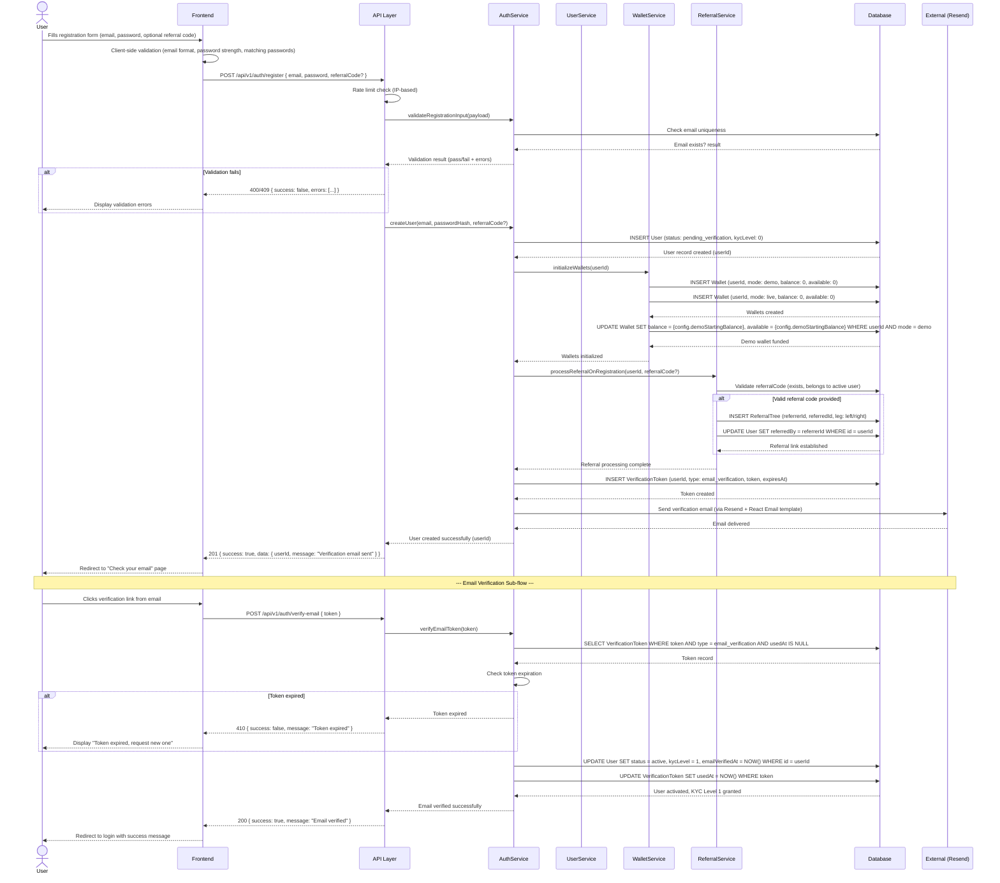

### Step-by-Step Description

1. **Form Submission:** The user completes the registration form providing their email address, a password meeting complexity requirements (8+ characters, uppercase, lowercase, number), and an optional referral code (which may be pre-populated from a URL query parameter `?ref=CODE`).

2. **Client-Side Validation:** The frontend validates email format, password strength in real-time, and that the password confirmation matches. Invalid fields are highlighted before submission.

3. **Server-Side Validation:** The API layer enforces rate limiting on the registration endpoint (per-IP). The AuthService validates the payload schema using Zod and checks that the email is not already registered in the database.

4. **User Record Creation:** On successful validation, a user record is inserted with `status: pending_verification` and `kycLevel: 0`. The password is hashed with bcrypt before storage.

5. **Wallet Initialization:** Two wallet records are created — one for Demo mode and one for Live mode, both starting at $0. The Demo wallet is immediately credited with the configurable starting balance (default: $10,000).

6. **Referral Processing:** If a valid referral code is provided, the system establishes the referral relationship by inserting a record in the ReferralTree table and updating the new user's `referredBy` field. The new user is placed in the binary tree under the referrer (left or right leg based on the placement strategy).

7. **Verification Email Dispatch:** A unique verification token is generated, stored in the database with a configurable expiration (default: 24 hours), and sent to the user's email via the Resend + React Email pipeline.

8. **Email Verification:** When the user clicks the verification link, the token is validated against the database. If valid and unexpired, the user's status is set to `active` and KYC level is upgraded to Level 1 (email verified), enabling deposits and basic platform features.

---

## 3. Deposit Flow — Cryptocurrency

The cryptocurrency deposit flow handles the receipt of Bitcoin (BTC), Ethereum (ETH), and Tether (USDT) from users. It involves blockchain monitoring, confirmation tracking, USD conversion at market rates, admin approval, and balance crediting. This flow also triggers the referral commission pipeline.

### Sequence Diagram

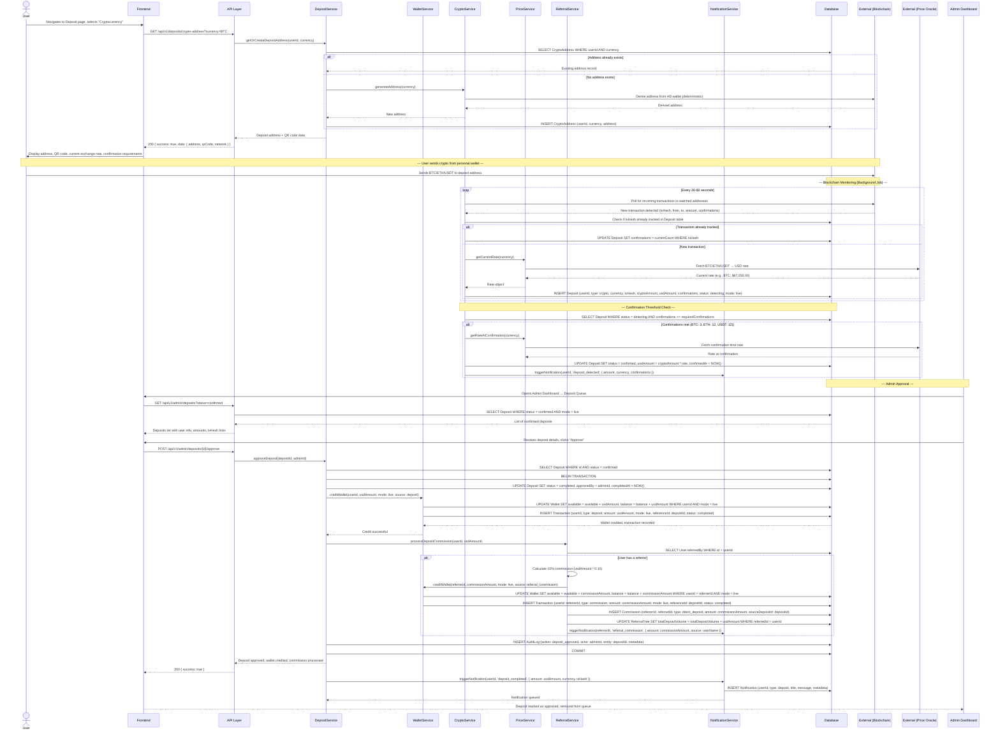

### Step-by-Step Description

1. **Address Generation:** When the user requests a crypto deposit, the system checks if they already have a deposit address for the selected cryptocurrency. If not, a new address is derived deterministically from the platform's HD wallet and stored in the database. The address and a QR code are returned to the frontend.

2. **Blockchain Monitoring:** A background job continuously polls the blockchain for incoming transactions to all watched deposit addresses. When a new transaction is detected, a Deposit record is created in `detecting` status with the transaction hash, crypto amount, and current USD conversion rate from the price oracle.

3. **Confirmation Tracking:** The monitoring job updates the confirmation count on each detected deposit. Once the required threshold is met (3 for BTC, 12 for ETH/USDT), the deposit status is updated to `confirmed` and the USD amount is recalculated using the confirmation-time exchange rate.

4. **Admin Approval:** Confirmed deposits appear in the admin dashboard's deposit verification queue. An administrator reviews the deposit details (user info, amount, blockchain transaction) and approves or rejects. Approval triggers the wallet crediting process.

5. **Wallet Crediting:** Upon approval, the deposit amount (in USD) is added to the user's Live wallet's available balance within a database transaction. A Transaction record is created to log the credit.

6. **Referral Commission Trigger:** If the depositing user was referred, the system calculates the 10% direct referral commission and credits it to the referrer's Live wallet. A Commission record is created, the referral tree's volume counters are updated, and the referrer is notified.

7. **Notification Dispatch:** The depositing user receives an in-app notification and email confirming the deposit has been completed. If a referral commission was generated, the referrer also receives a notification.

---

## 4. Deposit Flow — Gift Card

The gift card deposit flow enables users who lack access to cryptocurrency to fund their accounts using retail gift cards. This is a manual verification process where administrators review the submitted card details and image before crediting the user's wallet.

### Sequence Diagram

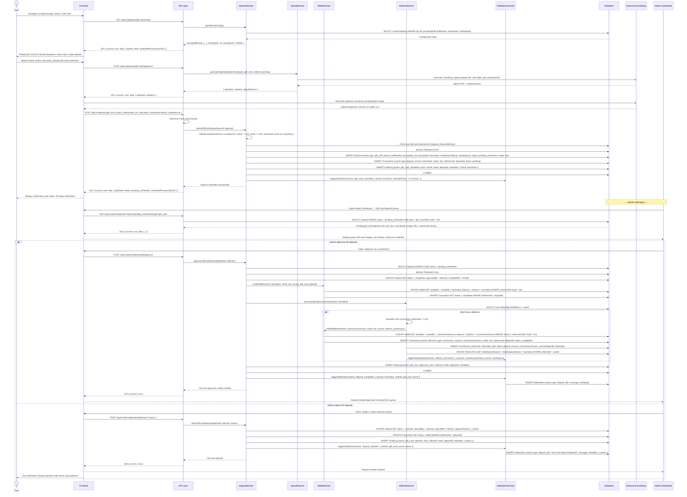

### Step-by-Step Description

1. **Configuration Retrieval:** The frontend fetches the list of accepted gift card brands, deposit limits, and estimated processing time to populate the deposit form.

2. **Image Upload:** The user selects a gift card brand, enters the face value, and uploads a screenshot of the card. The image is uploaded directly to Cloudinary using a pre-signed URL (offloading transfer from the application server). The upload validates file type (JPEG, PNG, WEBP) and size (max 10MB).

3. **Deposit Submission:** The frontend submits the gift card details along with the Cloudinary reference. The DepositService validates the payload, checks the user's submission history for fraud patterns, and creates a Deposit record in `pending_verification` status with a corresponding `pending` Transaction record.

4. **Admin Review:** Pending gift card deposits appear in the admin dashboard's dedicated verification queue. Each entry shows the card image, user information, declared face value, brand, and the user's historical approval/rejection ratio. Administrators can verify card validity using external tools before making a decision.

5. **Approval Path:** Upon approval, the face value is credited to the user's Live wallet, the Transaction status is updated to `completed`, and the referral commission pipeline is triggered (same 10% direct commission flow as cryptocurrency deposits).

6. **Rejection Path:** Upon rejection, the Transaction status is set to `failed`, and the user receives a notification with the specific rejection reason and guidance on next steps (e.g., re-submit with a clearer image, try a different brand).

---

## 5. Investment Flow

The investment flow handles the user's selection of an investment plan, funding from their wallet balance, tracking of the investment lifecycle, and the processing of returns upon plan maturity. This is the core financial engine of the platform.

### Sequence Diagram

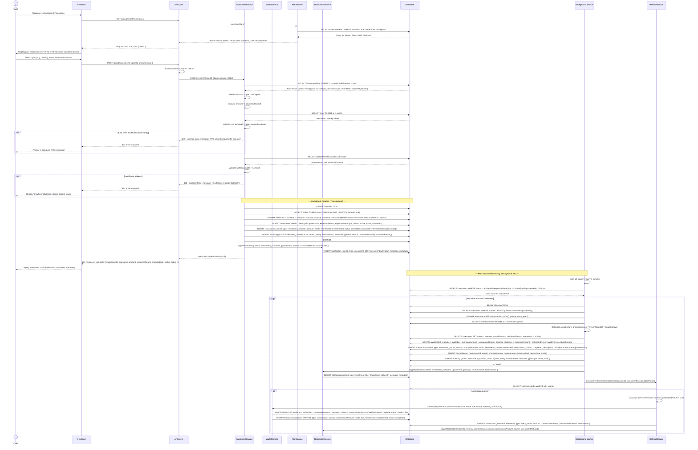

### Step-by-Step Description

1. **Plan Browsing:** The user views available investment plans with their tier details (minimum/maximum amounts, duration, expected return rate, KYC level requirement). Plans that require a higher KYC level than the user currently has are visually locked.

2. **Investment Validation:** When the user submits an investment request, the system validates: the amount is within the plan's min/max range, the user's KYC level meets the plan's requirement (Live mode only), and the user's available wallet balance is sufficient for the mode (Demo or Live).

3. **Funding (Deduction):** Within a database transaction with row-level locking on the wallet, the investment amount is deducted from the user's available balance. An Investment record is created with the plan details, expected maturity timestamp, and expected return amount. A negative Transaction record is created for the deduction.

4. **Active Tracking:** The investment appears in the user's dashboard with a countdown timer to maturity. The frontend can poll the API or use Server-Sent Events to display real-time progress updates.

5. **Maturity Detection:** A background worker (cron job, running every minute) queries for investments where `status = active`, `expectedMaturityAt <= NOW()`, and `processedAt IS NULL`. This triple condition ensures idempotency — once an investment is processed, the `processedAt` timestamp prevents reprocessing.

6. **Return Calculation and Crediting:** For each matured investment, the worker calculates the actual return (principal × daily return rate × duration in days), credits the principal plus return to the user's wallet, creates a PayoutRecord, and updates the investment status to `matured`. The entire operation is wrapped in a database transaction.

7. **Referral Commission on Returns:** If the investing user was referred, a 10% commission on the return amount (not the principal) is calculated and credited to the referrer's Live wallet. This is separate from the deposit commission and is triggered on investment maturity.

8. **Notification:** The user receives an in-app notification and email informing them their investment has matured and the total amount credited. If a referral commission was generated, the referrer is also notified.

---

## 6. Withdrawal Flow

The withdrawal flow governs how users move funds out of the platform. It enforces KYC requirements, calculates the 21% platform fee, places funds in a pending state, routes the request through admin approval, and processes the actual payout.

### Sequence Diagram

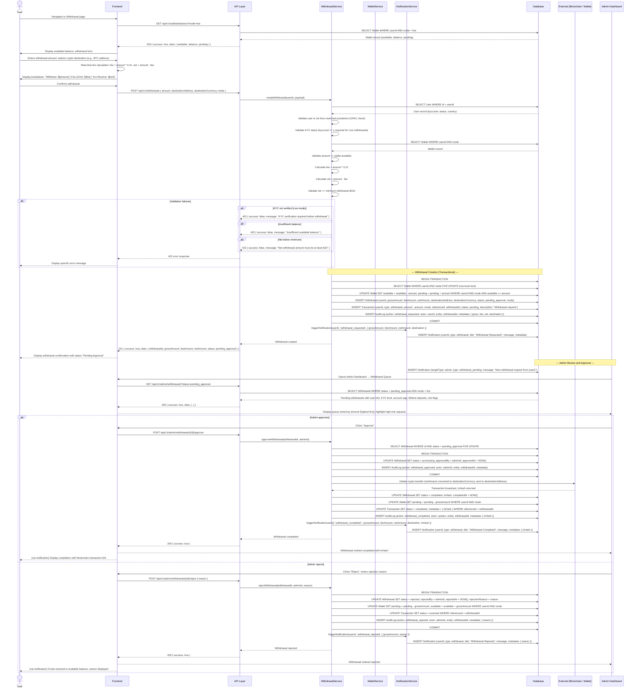

### Step-by-Step Description

1. **Pre-Submission Validation Display:** The frontend fetches the user's Live wallet balance and displays the withdrawal form. As the user types an amount, the real-time fee calculation (21% of gross amount) and net amount are displayed. The fee breakdown explanation (account management, signal fees, insurance, certification, VAT) is shown below.

2. **Server-Side Validation:** Upon submission, the backend validates: the user is not from a restricted jurisdiction, KYC level is at least Level 1 (for Live withdrawals), the requested amount does not exceed available balance, and the net amount meets the $10 minimum threshold.

3. **Balance Locking:** Within a database transaction, the gross amount is moved from the user's `available` balance to their `pending` balance. This prevents the funds from being used for investments or additional withdrawals while the request is being reviewed. A Withdrawal record is created in `pending_approval` status.

4. **Admin Review:** Pending withdrawals appear in the admin dashboard's approval queue, sorted by amount (highest first for priority review). Each entry shows the user's KYC level, account age, lifetime deposits, destination address, and any risk flags. Large withdrawals from recently registered accounts are highlighted for additional scrutiny.

5. **Approval and Payout:** Upon approval, the system initiates the actual cryptocurrency transfer to the user's designated destination address. The net amount is converted to the selected cryptocurrency and broadcast to the blockchain. Once the transaction is confirmed and a txHash is obtained, the withdrawal is marked as `completed`.

6. **Rejection and Refund:** Upon rejection, the full gross amount (no fee deducted) is moved back from `pending` to `available` balance. The user is notified with the specific rejection reason.

7. **Fee Distribution:** The 21% fee collected on approved withdrawals is allocated internally across operational cost categories (management, signals, insurance, certification, VAT). The specific allocation percentages are configurable by administrators.

---

## 7. Referral Commission Flow

The referral system operates on two commission tracks: direct referral commissions (10% on referred user deposits) and binary bonuses (calculated on weaker leg volume). This flow covers the data movement from user registration with a referral code through commission crediting and binary bonus settlement.

### Sequence Diagram

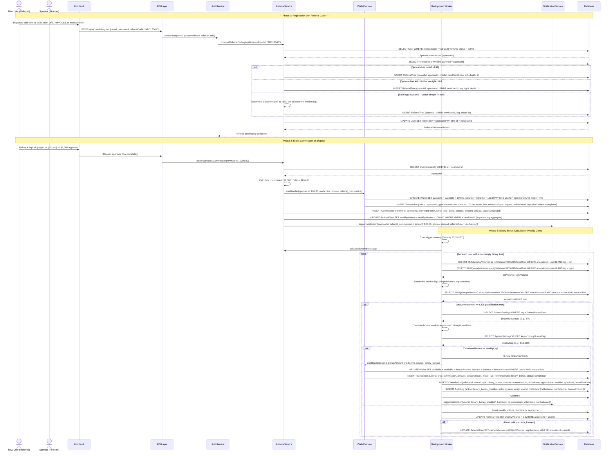

### Step-by-Step Description

1. **Registration Link Capture:** When a new user registers with a referral code, the system validates the code belongs to an active user and establishes the referral relationship in the ReferralTree. The new user is placed in the binary tree under the sponsor — on the left leg if empty, right leg if left is occupied, or deeper in the tree following the placement strategy.

2. **Direct Deposit Commission:** When a referred user's deposit is approved (crypto or gift card), the system immediately calculates 10% of the deposit amount (in USD) as the sponsor's commission. The commission is credited to the sponsor's Live wallet available balance, a Commission record is created, and the weekly volume counter for the appropriate leg is incremented.

3. **Direct Return Commission:** When a referred user's investment matures, an additional 10% commission on the return amount (not the principal) is calculated and credited to the sponsor's Live wallet. This is separate from the deposit commission.

4. **Binary Bonus Qualification:** To qualify for binary bonuses, a user must have at least $200 in active investments (across any plan tiers). This qualification check runs during the weekly calculation cycle.

5. **Binary Bonus Calculation:** At the weekly cycle close (configurable, default Sunday 23:59 UTC), the background worker aggregates deposit volumes for each user's left and right legs. The bonus is calculated on the weaker leg's volume at the configured rate (e.g., 5%), subject to a weekly cap.

6. **Carry-Forward Policy:** Depending on the configured flush policy, the volume difference between the stronger and weaker legs may carry forward to the next weekly cycle, rewarding sustained balanced team building.

7. **Notification:** Sponsors receive in-app and email notifications for both direct commissions (immediately) and binary bonuses (after weekly calculation). Notifications include the amount, source, and current wallet balance.

---

## 8. KYC Verification Flow

The KYC (Know Your Customer) verification flow manages the progressive identity verification of users through three levels. Each level unlocks higher deposit limits, access to premium investment plans, and the ability to withdraw funds.

### Sequence Diagram

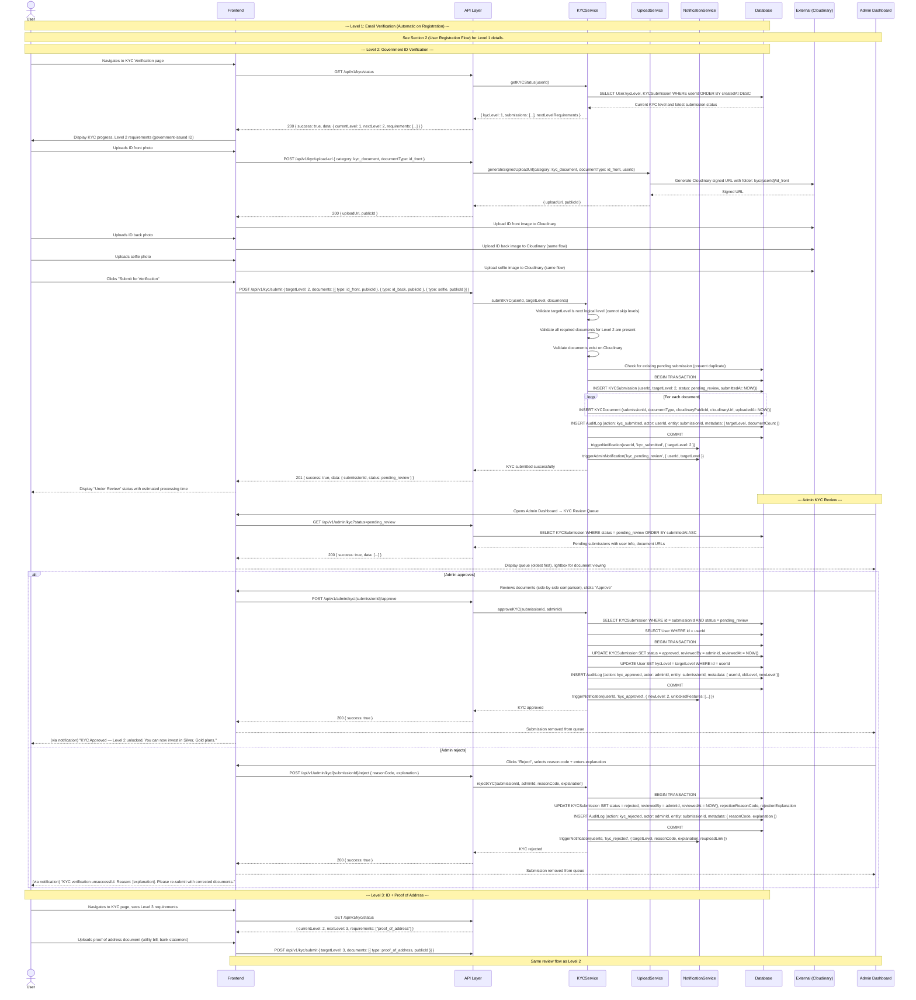

### Step-by-Step Description

1. **Level 1 — Email Verification:** Automatically granted upon registration when the user clicks the email verification link. This is covered in the User Registration Flow (Section 2). Enables basic platform access and Demo mode.

2. **Level 2 — Government ID Verification:** The user uploads their government-issued ID (front and back) and a selfie. Documents are uploaded to Cloudinary via signed URLs for secure, direct transfer. The submission enters `pending_review` status and an admin notification is dispatched.

3. **Admin Review:** Administrators view pending submissions in a dedicated queue (oldest first). The review interface supports side-by-side document comparison and a lightbox for zooming. The admin approves or rejects with a structured reason code and explanation.

4. **Approval:** On approval, the user's KYC level is incremented, unlocking access to higher-tier investment plans and increased limits. The user is notified of the approval and what features are now available.

5. **Rejection:** On rejection, the user is notified with the specific reason and guidance on how to correct the submission. The user can re-upload documents through a pre-filled re-submission form that maintains context from the previous attempt.

6. **Level 3 — Proof of Address:** Users seeking full platform access (Platinum plans, maximum withdrawal limits) submit a proof of address document (utility bill, bank statement). The same review flow applies.

---

## 9. Plan Maturity Processing Flow

The plan maturity processing flow is a critical background job that runs on a scheduled interval to detect investments that have reached their maturity timestamp, calculate returns, credit wallets, and trigger downstream effects (commissions, notifications). This flow must be idempotent and resilient to failures.

### Sequence Diagram

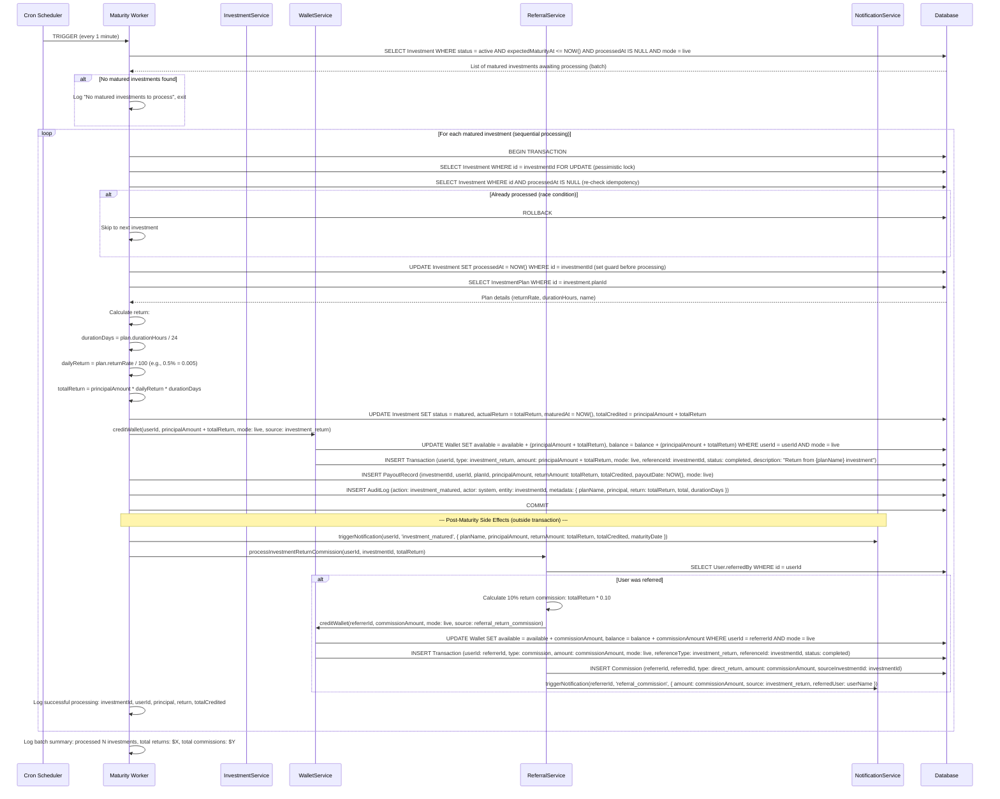

### Step-by-Step Description

1. **Scheduled Trigger:** The maturity worker is invoked by a cron scheduler every 1 minute. This frequency ensures timely processing even for the shortest plan (Basic: 24 hours) while keeping the query load manageable.

2. **Batch Retrieval:** The worker queries for all investments that are `active`, have reached their `expectedMaturityAt` timestamp, and have not been processed (`processedAt IS NULL`). The `mode = live` filter ensures only real-money investments are processed.

3. **Idempotency Guard:** Each investment is processed within a database transaction with a `FOR UPDATE` lock. The `processedAt` timestamp is set immediately at the start of processing as a guard against concurrent worker instances or retries processing the same investment twice.

4. **Return Calculation:** The return is calculated using the formula: `Principal × (Daily Return Rate / 100) × Duration in Days`. For example, a $5,000 Gold plan investment (7 days, 0.5% daily) would yield: $5,000 × 0.005 × 7 = $175.00 return, with a total credit of $5,175.00.

5. **Wallet Crediting:** Both the principal and the return are credited to the user's Live wallet available balance. A Transaction record is created for the credit, and a PayoutRecord captures the full details of the maturity event for reporting and audit purposes.

6. **Referral Commission Processing:** After the main transaction commits, the referral commission pipeline is triggered. A 10% commission on the return amount is calculated for the user's referrer and credited to the referrer's Live wallet. This is performed outside the main transaction to isolate commission failures from the core maturity processing.

7. **Notification Dispatch:** The investing user receives an in-app notification and email with the maturity details (plan name, principal, return, total credited). The referrer receives a commission notification if applicable.

8. **Batch Summary:** After processing all matured investments, the worker logs a summary of the batch (count, total returns, total commissions) for operational monitoring and alerting.

---

## 10. Admin Approval Flows

Administrators serve as the human-in-the-loop for three critical approval workflows: deposit verification, withdrawal processing, and KYC review. Each flow follows a consistent pattern of queue retrieval, review, decision, and downstream effect execution, with full audit logging.

### 10.1 Deposit Approval Flow

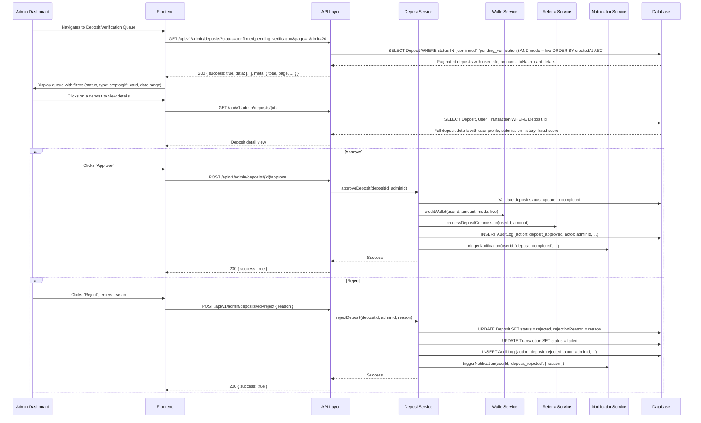

### 10.2 Withdrawal Approval Flow

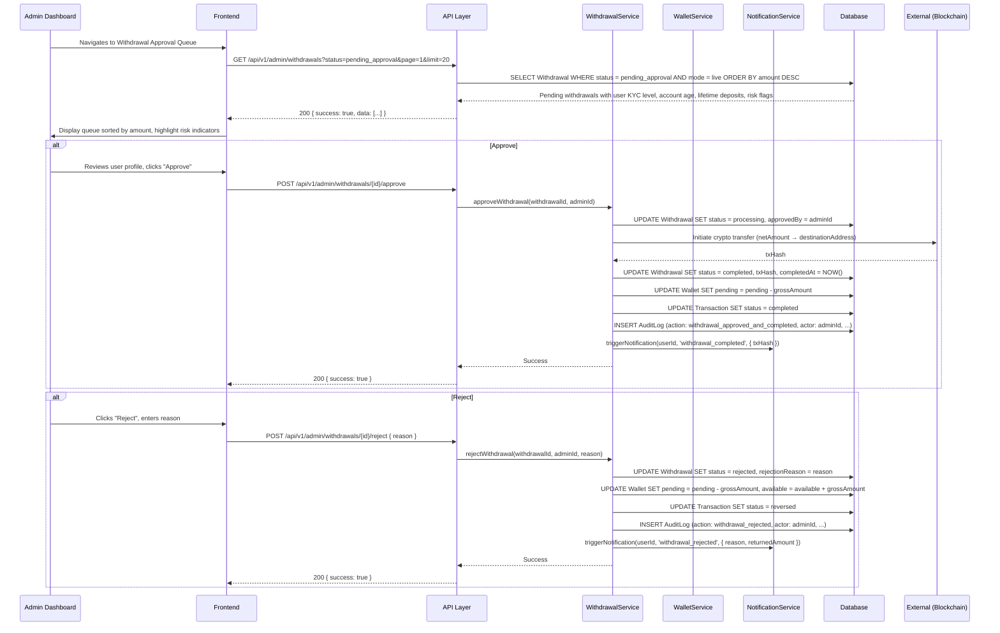

### 10.3 KYC Approval/Rejection Flow

```mermaid
sequenceDiagram
    participant Admin as Admin Dashboard
    participant FE as Frontend
    participant API as API Layer
    participant KycSvc as KYCService
    participant NotifSvc as NotificationService
    participant DB as Database

    Admin->>FE: Navigates to KYC Review Queue
    FE->>API: GET /api/v1/admin/kyc?status=pending_review&page=1&limit=20
    API->>DB: SELECT KYCSubmission WHERE status = pending_review ORDER BY submittedAt ASC
    DB-->>API: Submissions with user info, document URLs, current KYC level
    API-->>FE: 200 { success: true, data: [...] }

    FE->>Admin: Display queue with document thumbnails

    Admin->>FE: Clicks submission to review documents in lightbox
    FE->>API: GET /api/v1/admin/kyc/{submissionId}
    API->>DB: SELECT KYCSubmission, KYCDocument, User WHERE submissionId
    DB-->>API: Full submission with documents, user profile, previous submission history
    API-->>FE: Full detail view with side-by-side document comparison

    alt Approve
        Admin->>FE: Reviews documents, clicks "Approve"
        FE->>API: POST /api/v1/admin/kyc/{submissionId}/approve
        API->->KycSvc: approveKYC(submissionId, adminId)
        KycSvc->>DB: UPDATE KYCSubmission SET status = approved, reviewedBy = adminId, reviewedAt = NOW()
        KycSvc->>DB: UPDATE User SET kycLevel = targetLevel WHERE id = userId
        KycSvc->>DB: INSERT AuditLog (action: kyc_approved, actor: adminId, ...)
        KycSvc->>NotifSvc: triggerNotification(userId, 'kyc_approved', { newLevel, unlockedFeatures })
        KycSvc-->>API: Success
        API-->>FE: 200 { success: true }
    end

    alt Reject
        Admin->>FE: Selects reason code, enters explanation, clicks "Reject"
        FE->>API: POST /api/v1/admin/kyc/{submissionId}/reject { reasonCode, explanation }
        API->->KycSvc: rejectKYC(submissionId, adminId, reasonCode, explanation)
        KycSvc->>DB: UPDATE KYCSubmission SET status = rejected, reviewedBy = adminId, reviewedAt = NOW(), rejectionReasonCode, rejectionExplanation
        KycSvc->->DB: INSERT AuditLog (action: kyc_rejected, actor: adminId, ...)
        KycSvc->->NotifSvc: triggerNotification(userId, 'kyc_rejected', { reasonCode, explanation, reuploadLink })
        KycSvc-->>API: Success
        API-->>FE: 200 { success: true }
    end

    alt Request Additional Documents
        Admin->>FE: Clicks "Request More Info", specifies which documents needed
        FE->>API: POST /api/v1/admin/kyc/{submissionId}/request-info { requiredDocuments: ["proof_of_address"], message }
        API->->KycSvc: requestAdditionalDocuments(submissionId, adminId, requiredDocuments, message)
        KycSvc->>DB: UPDATE KYCSubmission SET status = info_requested, additionalDocumentsRequested, adminMessage
        KycSvc->->DB: INSERT AuditLog (action: kyc_info_requested, actor: adminId, ...)
        KycSvc->->NotifSvc: triggerNotification(userId, 'kyc_info_requested', { requiredDocuments, message })
        KycSvc-->>API: Success
        API-->>FE: 200 { success: true }
    end
```

### Admin Flow Summary

| Flow | Trigger | Review Criteria | Approval Effect | Rejection Effect |
|------|---------|----------------|-----------------|------------------|
| **Deposit** | Crypto confirmed / Gift card submitted | Valid blockchain tx, correct amount, no fraud indicators | Credit wallet, trigger referral commission | Mark as failed, notify user with reason |
| **Withdrawal** | User submits withdrawal request | KYC level, account age, risk flags, sufficient balance | Initiate crypto transfer, complete withdrawal | Return funds to available balance, notify user |
| **KYC** | User submits verification documents | Document authenticity, readable info, facial match, sanctions check | Upgrade KYC level, unlock features | Notify user with reason, allow re-submission |

All admin actions are recorded in the immutable AuditLog with the admin's identity, timestamp, IP address, and the full context of the decision (what was approved/rejected, the reason, and any metadata).

---

## 11. Notification Flow

The notification system is the platform's event-driven communication layer. It generates in-app notifications and email notifications in response to platform events, respecting user preferences and channel-specific delivery requirements.

### 11.1 Notification Event Matrix

| Event Category | Event | In-App | Email | Admin Notification |
|---------------|-------|--------|-------|-------------------|
| **Account** | Registration completed | Yes | Yes (verification email) | No |
| **Account** | Email verified | Yes | Yes | No |
| **Account** | Password changed | Yes | Yes (mandatory) | No |
| **Account** | New login detected | Yes | Yes (mandatory) | No |
| **Account** | 2FA enabled/disabled | Yes | Yes (mandatory) | No |
| **Account** | Account locked | No | Yes | No |
| **Deposit** | Crypto deposit detected | Yes | Yes | No |
| **Deposit** | Deposit confirmed & credited | Yes | Yes | No |
| **Deposit** | Gift card submitted | Yes | Yes | Yes (admin queue) |
| **Deposit** | Gift card rejected | Yes | Yes | No |
| **Investment** | Investment activated | Yes | Yes | No |
| **Investment** | Investment matured | Yes | Yes | No |
| **Withdrawal** | Withdrawal requested | Yes | Yes | Yes (admin queue) |
| **Withdrawal** | Withdrawal approved | Yes | Yes | No |
| **Withdrawal** | Withdrawal completed | Yes | Yes (with txHash) | No |
| **Withdrawal** | Withdrawal rejected | Yes | Yes | No |
| **KYC** | KYC submitted | Yes | Yes | Yes (admin queue) |
| **KYC** | KYC approved | Yes | Yes | No |
| **KYC** | KYC rejected | Yes | Yes | No |
| **KYC** | Additional docs requested | Yes | Yes | No |
| **Referral** | Direct commission credited | Yes | Yes | No |
| **Referral** | Binary bonus credited | Yes | Yes | No |
| **Support** | Ticket response received | Yes | Yes (if enabled) | No |
| **System** | Scheduled maintenance | Yes | Yes | Yes |
| **Admin** | New KYC pending | No | Yes | Yes |
| **Admin** | New withdrawal pending | No | Yes | Yes |
| **Admin** | New gift card pending | No | Yes | Yes |
| **Admin** | Suspicious activity alert | No | Yes | Yes |

### 11.2 Notification Processing Flow

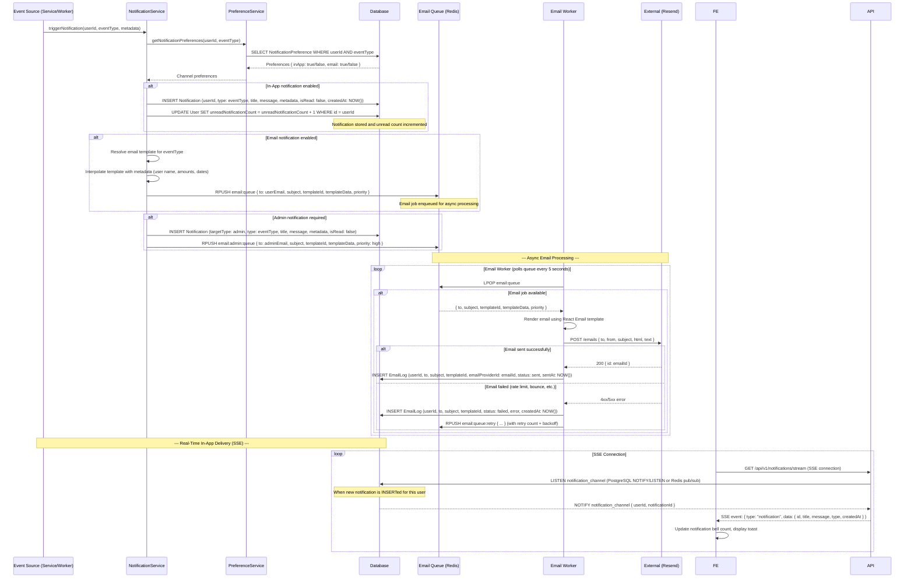

### 11.3 Notification Delivery Details

**In-App Notifications:**
- Stored in the `Notification` table with `isRead: false` by default
- Delivered in real-time via Server-Sent Events (SSE) to connected clients
- Displayed as a toast/banner for high-priority events (deposit confirmed, investment matured)
- The notification bell icon in the navigation shows the unread count
- Users can mark individual notifications as read or mark all as read
- Notifications persist indefinitely in the database and are never deleted

**Email Notifications:**
- Rendered using React Email templates matching the platform's visual identity
- Enqueued in Redis for asynchronous processing by the email worker
- The email worker processes the queue every 5 seconds with batch processing support
- Failed emails are retried with exponential backoff (3 retries over 15 minutes)
- Security emails (login alerts, password changes) are mandatory and cannot be disabled
- Users can configure preferences per event category and per channel

**Admin Notifications:**
- Operational events (new KYC, new withdrawals, suspicious activity) trigger both in-app admin notifications and emails
- Admin in-app notifications appear in the admin dashboard's notification center
- High-priority admin emails (large withdrawals, fraud alerts) are sent immediately with high priority in the queue

---

## 12. Data Entity Relationship Overview

The following flowchart illustrates how data moves between the primary entities in the TeslaPrimeCapital platform. Each entity box represents a database table or external system, and the arrows show the direction and nature of data flow.

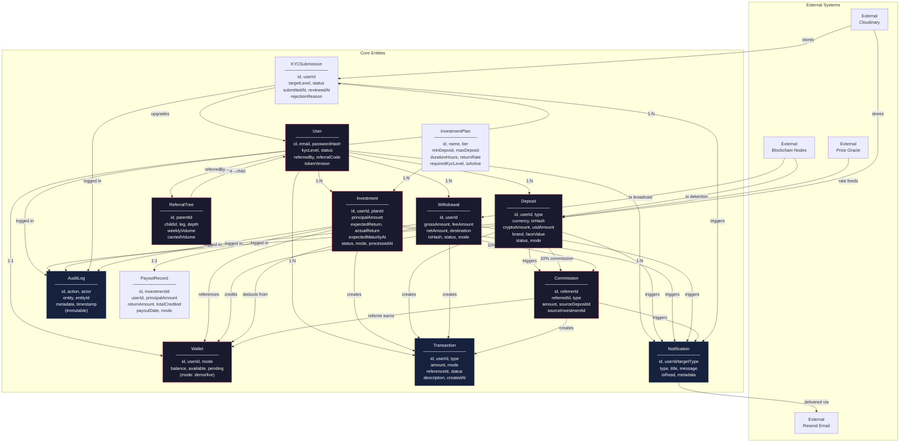

### Entity Relationship Summary

| Relationship | Cardinality | Description |
|-------------|-------------|-------------|
| User → Wallet | 1:2 | Each user has exactly two wallets (Demo and Live) |
| User → Investment | 1:N | A user can have multiple active and historical investments |
| User → Deposit | 1:N | A user can have multiple deposits across methods |
| User → Withdrawal | 1:N | A user can have multiple withdrawal requests |
| User → KYCSubmission | 1:N | A user can have multiple KYC submissions (re-submissions after rejection) |
| User → Transaction | 1:N | All financial events create Transaction records |
| User → Notification | 1:N | All notifications are scoped to a user |
| InvestmentPlan → Investment | 1:N | A plan can have many investments from different users |
| Investment → PayoutRecord | 1:1 | Each matured investment generates one payout record |
| User → ReferralTree | 1:N | A user can have many nodes in the referral tree (as parent or child) |
| Deposit → Commission | 1:1 | Each deposit may trigger one direct commission |
| Investment → Commission | 1:1 | Each matured investment may trigger one return commission |
| ReferralTree → Commission | N:1 | Binary bonuses aggregate from tree volumes |

### Data Flow Patterns by Entity

- **Wallet:** Acts as the central ledger for each user-mode combination. All credits (deposits, returns, commissions) and debits (investments, withdrawals) flow through the wallet's `available` and `pending` balances. The `balance` field represents total funds (available + pending + invested).
- **Transaction:** An immutable log of every financial movement. Each record has a `referenceId` linking it to the source entity (Deposit, Investment, Withdrawal, Commission) and a `status` field tracking the lifecycle (pending → completed → reversed).
- **AuditLog:** An immutable, append-only log of all significant platform actions. Entries cannot be edited or deleted. Used for compliance, debugging, and dispute resolution.
- **Commission:** Tracks both direct referral commissions (10% on deposits and returns) and binary bonuses. Each record links to the source event (deposit or investment) and the referrer who earned it.

---

## 13. Demo Mode Data Flow

Demo mode provides a fully functional simulated environment that mirrors the Live platform experience without involving real money, real blockchain transactions, or KYC verification. The two modes share the same codebase, API structure, and UI, but are strictly isolated at the data layer.

### 13.1 Demo Mode Isolation Architecture

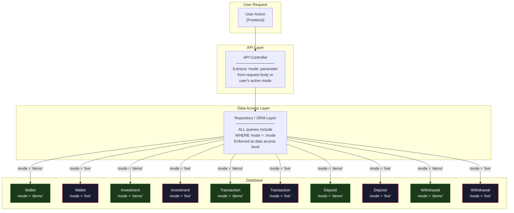

### 13.2 Demo Mode Data Flow Rules

| Aspect | Demo Mode | Live Mode |
|--------|-----------|-----------|
| **Starting Balance** | Configurable (default: $10,000) credited on registration | $0 — must deposit real funds |
| **Deposit Method** | Simulated — user selects type and enters amount, funds credited instantly | Real crypto (blockchain) or gift card (admin review) |
| **Investment Plans** | Same 4 tiers, same durations, same return rates | Same 4 tiers, same durations, same return rates |
| **Investment Returns** | Same calculation formula, simulated | Same calculation formula, real money |
| **Withdrawals** | Simulated — 21% fee displayed, no real payout, funds returned to Demo wallet | Real crypto transfer to user's wallet, 21% fee deducted |
| **KYC Required** | No — all plan tiers accessible without KYC | Yes — Level 1 for Basic, Level 2 for Silver/Gold, Level 3 for Platinum |
| **Referral Commissions** | Referral relationships are real, but Demo deposit/return commissions are credited to Demo wallet (if configured) | All commissions credited to Live wallet |
| **Admin Queues** | Not displayed — no admin review needed | Deposits, withdrawals, KYC displayed for admin action |
| **Notifications** | Same events, prefixed with "Demo:" indicator | Standard notifications |
| **Data Isolation** | All records have `mode = 'demo'` — never included in Live queries | All records have `mode = 'live'` — never mixed with Demo |

### 13.3 Simulated Crypto Deposit Flow (Demo Mode)

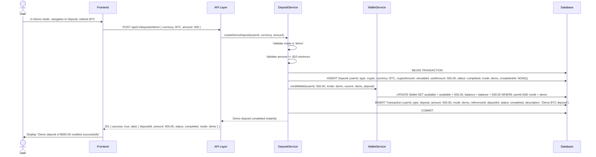

### 13.4 Demo Investment Flow

```mermaid
sequenceDiagram
    actor User
    participant FE as Frontend
    participant API as API Layer
    participant InvSvc as InvestmentService
    participant WalletSvc as WalletService
    participant DB as Database
    participant Worker as Background Worker

    User->>FE: In Demo mode, selects Gold plan, enters $10,000
    FE->>API: POST /api/v1/investments { planId, amount: 10000, mode: demo }
    API->>InvSvc: createInvestment(userId, planId, 10000, demo)
    InvSvc->>DB: SELECT Wallet WHERE userId AND mode = demo
    DB-->>InvSvc: Available balance: $10,500 (initial $10,000 + $500 deposit)

    InvSvc->>DB: BEGIN TRANSACTION
    InvSvc->>DB: UPDATE Wallet SET available = available - 10000, balance = balance - 10000 WHERE userId AND mode = demo
    InvSvc->>DB: INSERT Investment (userId, planId, principalAmount: 10000, expectedReturn: 350.00, expectedMaturityAt: NOW() + 7 days, status: active, mode: demo)
    InvSvc->>DB: INSERT Transaction (userId, type: investment, amount: -10000, mode: demo, status: completed)
    InvSvc->->DB: COMMIT

    InvSvc-->>API: Demo investment created
    API-->>FE: 201 { success: true, data: { investmentId, status: active, maturityDate } }
    FE->>User: Display active demo investment with countdown

    Note over Worker,DB: --- Demo Maturity (Same background worker) ---

    Worker->>DB: SELECT Investment WHERE status = active AND expectedMaturityAt <= NOW() AND processedAt IS NULL AND mode = demo
    DB-->>Worker: Matured demo investments

    Worker->>DB: BEGIN TRANSACTION
    Worker->>DB: UPDATE Investment SET status = matured, actualReturn: 350.00, processedAt: NOW()
    Worker->>DB: UPDATE Wallet SET available = available + 10350.00, balance = balance + 10350.00 WHERE userId AND mode = demo
    Worker->>DB: INSERT Transaction (userId, type: investment_return, amount: 10350.00, mode: demo, status: completed)
    Worker->>DB: INSERT PayoutRecord (investmentId, userId, principal: 10000, return: 350, total: 10350, mode: demo)
    Worker->>DB: COMMIT

    Worker-->>Worker: Demo maturity processed (no referral commissions in demo)
```

### 13.5 Demo Withdrawal Flow

```mermaid
sequenceDiagram
    actor User
    participant FE as Frontend
    participant API as API Layer
    participant WdSvc as WithdrawalService
    participant WalletSvc as WalletService
    participant DB as Database

    User->>FE: In Demo mode, enters withdrawal amount: $1,000
    FE->>FE: Calculate: fee = $210, net = $790
    FE->>User: Display: "Withdraw: $1,000 | Fee (21%): $210 | You Receive: $790 (Demo)"

    User->>FE: Confirms withdrawal
    FE->>API: POST /api/v1/withdrawals { amount: 1000, destinationAddress: "demo_address", mode: demo }
    API->>WdSvc: createDemoWithdrawal(userId, 1000, mode: demo)
    WdSvc->>WdSvc: Skip KYC check (not required for demo)
    WdSvc->>DB: SELECT Wallet WHERE userId AND mode = demo

    WdSvc->>DB: BEGIN TRANSACTION
    WdSvc->>DB: UPDATE Wallet SET available = available - 1000 WHERE userId AND mode = demo
    WdSvc->->DB: INSERT Withdrawal (userId, grossAmount: 1000, feeAmount: 210, netAmount: 790, status: completed, mode: demo, completedAt: NOW(), note: "Demo withdrawal — no real funds transferred")
    WdSvc->->DB: INSERT Transaction (userId, type: withdrawal, amount: -1000, mode: demo, status: completed, description: "Demo withdrawal (fee: $210, net: $790)")
    WdSvc->->DB: COMMIT

    WdSvc-->>API: Demo withdrawal completed instantly (no admin review)
    API-->>FE: 201 { success: true, data: { withdrawalId, gross: 1000, fee: 210, net: 790, status: completed } }
    FE->>User: Display "Demo withdrawal of $790 (net) processed. No real funds were transferred."
```

### 13.6 Demo Mode Key Implementation Notes

1. **Data Access Enforcement:** The `mode` parameter is enforced at the repository/ORM layer, not at the service layer. Every query that touches a financial table includes `WHERE mode = :mode`. This prevents accidental cross-contamination even if a service method is called with the wrong mode.

2. **No Admin Queues:** Demo deposits, withdrawals, and KYC submissions never appear in admin queues. The admin dashboard exclusively shows `mode = 'live'` data for financial operations. Demo data is only visible in admin user management for understanding user behavior.

3. **No External Integrations:** Demo deposits do not generate blockchain addresses or interact with the price oracle. Demo withdrawals do not initiate crypto transfers. Demo KYC submissions do not upload to Cloudinary or trigger admin reviews. This eliminates all external API costs for demo activity.

4. **No Real Referral Commissions:** While referral relationships are real (established at registration), commissions generated from Demo mode activity are either not credited or credited to the Demo wallet (depending on configuration). Commissions from Live mode activity are always credited to the Live wallet, regardless of the sponsor's current mode.

5. **Background Worker Processing:** The same maturity worker processes both Demo and Live investments, differentiated by the `mode` column. Demo investments are processed identically to Live investments (same return calculation, same wallet crediting) but without triggering referral commissions or external notifications (or with a "Demo:" prefix on notifications).

6. **Mode Switching:** Users can toggle between Demo and Live modes at any time via the navigation bar. The mode switch updates the user's active mode preference and causes all subsequent API calls to use the new mode. The UI immediately reflects the new mode's balances, transactions, and investments.

7. **Reporting Isolation:** All financial reports in the admin dashboard aggregate only `mode = 'live'` data. Demo data is excluded from revenue calculations, platform balance summaries, and compliance reports. Separate demo usage analytics (registration-to-deposit conversion, plan selection patterns) may be tracked for product insights.

---

## Appendix: Data Flow Cross-Reference

| Flow | Trigger | Primary Tables Written | External Dependencies | Admin Involvement | Background Job |
|------|---------|----------------------|----------------------|-------------------|----------------|
| Registration | User submits form | User, Wallet (×2), VerificationToken, ReferralTree | Resend (email) | No | No |
| Crypto Deposit | Blockchain tx detected | Deposit, Wallet, Transaction, Commission, AuditLog | Blockchain nodes, Price Oracle | Yes (approval) | Yes (monitoring, confirmations) |
| Gift Card Deposit | User submits card | Deposit, Wallet, Transaction, Commission, AuditLog | Cloudinary (image storage) | Yes (verification) | No |
| Investment | User selects plan | Investment, Wallet, Transaction, AuditLog | None | No | Yes (maturity processing) |
| Withdrawal | User submits request | Withdrawal, Wallet, Transaction, AuditLog | Blockchain (payout) | Yes (approval) | No |
| Referral Commission | Deposit/investment completes | Commission, Wallet, Transaction, ReferralTree | None | No | Yes (binary bonus) |
| KYC Verification | User submits documents | KYCSubmission, KYCDocument, User, AuditLog | Cloudinary (document storage) | Yes (review) | No |
| Plan Maturity | Cron schedule | Investment, Wallet, Transaction, PayoutRecord, Commission, AuditLog | None | No | Yes (primary trigger) |
| Notification | Any platform event | Notification, EmailLog | Resend (email delivery) | Indirect (admin alerts) | Yes (email worker) |

---

*This document is part of the TeslaPrimeCapital Phase 2 Technical Architecture documentation. All data flows described here are designed for implementation with the technology stack defined in the System Architecture document: Next.js 16 frontend, Node.js API with TypeScript, PostgreSQL database, Redis caching/queuing, and Cloudinary/Resend for external integrations.*