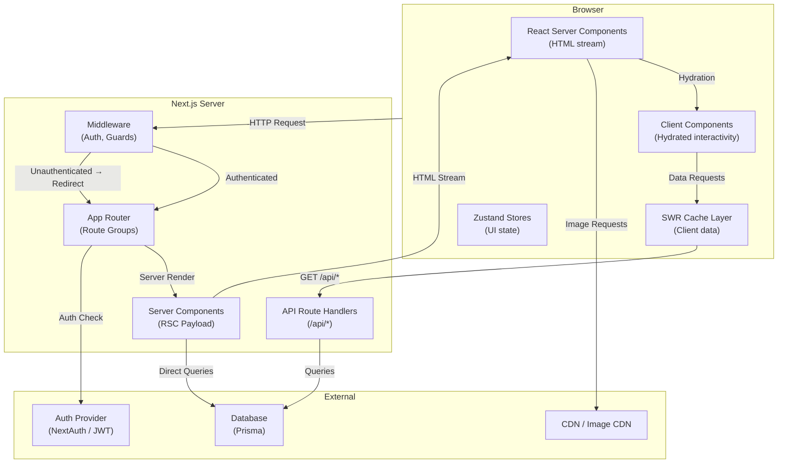
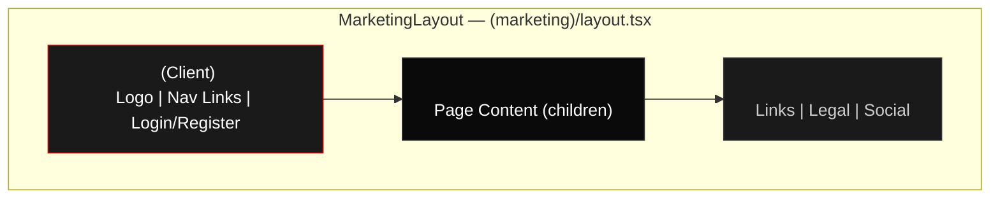
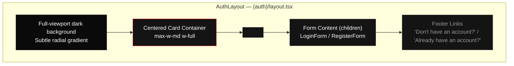
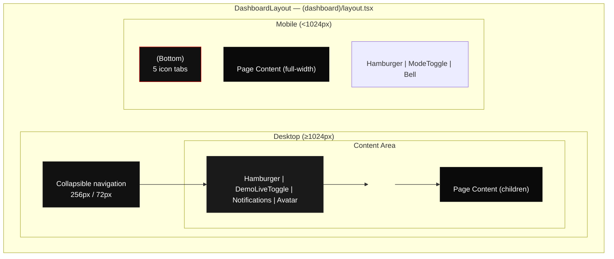
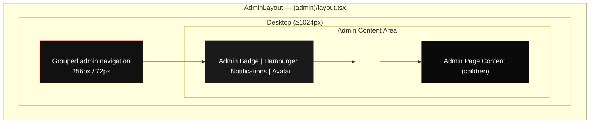
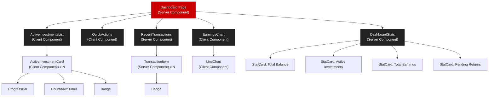

# Frontend Architecture — TeslaPrimeCapital

> **Project:** TeslaPrimeCapital — Enterprise Investment Platform  
> **Phase:** 2 — Technical Architecture  
> **Last Updated:** 2025  
> **Status:** Draft  

---

## Table of Contents

1. [Architecture Overview](#1-architecture-overview)
2. [Directory Structure](#2-directory-structure)
3. [Layout System](#3-layout-system)
4. [Component Architecture](#4-component-architecture)
5. [Routing Architecture](#5-routing-architecture)
6. [Design System](#6-design-system)
7. [Data Fetching Strategy](#7-data-fetching-strategy)
8. [Form Handling](#8-form-handling)
9. [Responsive Breakpoints & Mobile Navigation](#9-responsive-breakpoints--mobile-navigation)
10. [Performance Optimizations](#10-performance-optimizations)

---

## 1. Architecture Overview

TeslaPrimeCapital is built on **Next.js 14+ App Router** with React 18+, leveraging the hybrid rendering model that combines React Server Components (RSC) and Client Components for optimal performance and interactivity. The frontend serves as a single monolithic application that contains three distinct experiences: public marketing pages, an authenticated user dashboard, and an admin control panel.

### Core Principles

- **Server Components by Default:** Every page and component starts as a Server Component. The `'use client'` directive is added only when the component requires interactivity, browser APIs, React hooks, or client-side state management.
- **Colocation by Domain:** Components, hooks, types, and utilities are organized by feature domain rather than by technical role. This keeps related code physically close and mentally cohesive.
- **Progressive Enhancement:** The application renders meaningful HTML on the server first, then hydrates interactive features on the client. Pages remain functional even before JavaScript loads.
- **Dark-First Design:** The platform uses a dark theme exclusively. There is no light mode toggle. The Tesla red-and-black palette is applied consistently across all interfaces.

### Technology Stack

| Layer | Technology | Purpose |
|-------|-----------|---------|
| Framework | Next.js 14+ (App Router) | SSR, SSG, ISR, API routes, middleware |
| UI Library | React 18+ | Component rendering |
| Language | TypeScript (strict mode) | Type safety |
| Styling | Tailwind CSS 3.4+ | Utility-first CSS |
| Component Library | shadcn/ui | Accessible, composable UI primitives |
| Icons | Lucide React | Consistent icon set |
| Forms | React Hook Form + Zod | Form state management & validation |
| Data Fetching (Client) | SWR | Client-side caching, revalidation, optimistic updates |
| State Management | Zustand | Global client state (mode toggle, sidebar, UI) |
| Charts | Recharts | Data visualization (line, bar, pie) |
| Animation | Tailwind CSS + Framer Motion | Micro-interactions, page transitions |
| Font | Inter (via next/font/google) | Body text and headings |

### Architecture Diagram



---

## 2. Directory Structure

```
src/
├── app/                                # Next.js App Router — pages and layouts
│   ├── layout.tsx                      # Root layout (fonts, global providers, metadata)
│   ├── loading.tsx                     # Root loading fallback
│   ├── not-found.tsx                   # Global 404 page
│   ├── error.tsx                       # Global error boundary
│   ├── globals.css                     # Tailwind directives + custom CSS variables
│   │
│   ├── (marketing)/                    # Route group — public pages
│   │   ├── layout.tsx                  # MarketingLayout: Navbar + Footer
│   │   ├── page.tsx                    # Landing page (Home)
│   │   ├── about/
│   │   │   └── page.tsx                # About page
│   │   ├── plans/
│   │   │   └── page.tsx                # Public plans listing
│   │   ├── faq/
│   │   │   └── page.tsx                # FAQ page
│   │   ├── contact/
│   │   │   └── page.tsx                # Contact page
│   │   ├── privacy-policy/
│   │   │   └── page.tsx                # Privacy policy
│   │   ├── terms-of-service/
│   │   │   └── page.tsx                # Terms of service
│   │   └── forgot-password/
│   │       └── page.tsx                # Forgot password flow
│   │
│   ├── (auth)/                         # Route group — authentication pages
│   │   ├── layout.tsx                  # AuthLayout: centered card on dark bg
│   │   ├── login/
│   │   │   └── page.tsx                # Login page
│   │   └── register/
│   │       └── page.tsx                # Registration page
│   │
│   ├── (dashboard)/                    # Route group — authenticated user pages
│   │   ├── layout.tsx                  # DashboardLayout: Sidebar + Topbar + Content
│   │   ├── dashboard/
│   │   │   ├── page.tsx                # Dashboard home (stats, charts, quick actions)
│   │   │   ├── loading.tsx             # Dashboard skeleton
│   │   │   └── error.tsx               # Dashboard error boundary
│   │   ├── plans/
│   │   │   └── page.tsx                # Investment plans with invest modal
│   │   ├── deposit/
│   │   │   └── page.tsx                # Deposit flow (crypto + gift card)
│   │   ├── withdraw/
│   │   │   └── page.tsx                # Withdrawal form with fee breakdown
│   │   ├── wallet/
│   │   │   ├── page.tsx                # Wallet overview (balances + transactions)
│   │   │   └── [transactionId]/
│   │   │       └── page.tsx            # Transaction detail view
│   │   ├── referral/
│   │   │   └── page.tsx                # Referral program (link, team, tree)
│   │   ├── profile/
│   │   │   └── page.tsx                # Profile settings + password + 2FA
│   │   ├── kyc/
│   │   │   └── page.tsx                # KYC verification + document upload
│   │   ├── notifications/
│   │   │   └── page.tsx                # Notification list + preferences
│   │   └── support/
│   │       ├── page.tsx                # Ticket list
│   │       └── [ticketId]/
│   │           └── page.tsx            # Ticket conversation thread
│   │
│   └── (admin)/                        # Route group — admin control panel
│       ├── layout.tsx                  # AdminLayout: AdminSidebar + Topbar + Content
│       ├── admin/
│       │   ├── page.tsx                # Admin dashboard (stats, charts, activity)
│       │   ├── loading.tsx
│       │   ├── error.tsx
│       │   ├── users/
│       │   │   └── page.tsx            # User management (DataTable)
│       │   ├── users/[userId]/
│       │   │   └── page.tsx            # User detail panel
│       │   ├── kyc/
│       │   │   └── page.tsx            # KYC review queue
│       │   ├── deposits/
│       │   │   └── page.tsx            # Deposit management + gift card verification
│       │   ├── withdrawals/
│       │   │   └── page.tsx            # Withdrawal approval/rejection
│       │   ├── plans/
│       │   │   └── page.tsx            # Plan CRUD
│       │   ├── settings/
│       │   │   └── page.tsx            # Platform settings + feature flags
│       │   ├── audit-logs/
│       │   │   └── page.tsx            # Audit log viewer with filters
│       │   └── reports/
│       │       └── page.tsx            # Reports and analytics + export
│       └── api/                        # API Route Handlers (co-located or top-level)
│           ├── auth/
│           │   ├── login/route.ts
│           │   ├── register/route.ts
│           │   └── [...nextauth]/route.ts
│           ├── plans/route.ts
│           ├── deposits/route.ts
│           ├── withdrawals/route.ts
│           ├── wallet/route.ts
│           ├── notifications/route.ts
│           ├── kyc/route.ts
│           ├── referral/route.ts
│           ├── support/route.ts
│           └── admin/
│               ├── users/route.ts
│               ├── kyc/route.ts
│               ├── deposits/route.ts
│               ├── withdrawals/route.ts
│               ├── plans/route.ts
│               ├── settings/route.ts
│               ├── audit-logs/route.ts
│               └── reports/route.ts
│
├── components/                         # All React components
│   ├── ui/                             # shadcn/ui primitives + base components
│   │   ├── button.tsx
│   │   ├── input.tsx
│   │   ├── select.tsx
│   │   ├── textarea.tsx
│   │   ├── checkbox.tsx
│   │   ├── radio-group.tsx
│   │   ├── switch.tsx
│   │   ├── card.tsx
│   │   ├── badge.tsx
│   │   ├── avatar.tsx
│   │   ├── dialog.tsx
│   │   ├── sheet.tsx
│   │   ├── dropdown-menu.tsx
│   │   ├── tabs.tsx
│   │   ├── accordion.tsx
│   │   ├── tooltip.tsx
│   │   ├── alert.tsx
│   │   ├── progress.tsx
│   │   ├── skeleton.tsx
│   │   ├── separator.tsx
│   │   ├── scroll-area.tsx
│   │   ├── table.tsx
│   │   ├── pagination.tsx
│   │   ├── form.tsx
│   │   ├── label.tsx
│   │   ├── chart.tsx
│   │   ├── data-table.tsx
│   │   ├── file-upload.tsx
│   │   ├── search-input.tsx
│   │   ├── copy-button.tsx
│   │   ├── loading-spinner.tsx
│   │   ├── empty-state.tsx
│   │   ├── stat-card.tsx
│   │   ├── countdown-timer.tsx
│   │   ├── qr-code.tsx
│   │   ├── fee-breakdown.tsx
│   │   └── icon-button.tsx
│   │
│   ├── layout/                         # Layout shell components
│   │   ├── header.tsx                  # Public page header (Navbar)
│   │   ├── footer.tsx                  # Public page footer
│   │   ├── sidebar.tsx                 # Dashboard sidebar navigation
│   │   ├── admin-sidebar.tsx           # Admin sidebar navigation
│   │   ├── topbar.tsx                  # Dashboard top bar (mode toggle, notifications, avatar)
│   │   ├── admin-topbar.tsx            # Admin top bar
│   │   ├── demo-live-toggle.tsx        # Demo/Live mode switch
│   │   ├── mobile-nav.tsx              # Mobile bottom navigation bar
│   │   └── breadcrumb.tsx              # Breadcrumb navigation
│   │
│   ├── auth/                           # Authentication components
│   │   ├── login-form.tsx
│   │   ├── register-form.tsx
│   │   ├── otp-input.tsx
│   │   ├── forgot-password-form.tsx
│   │   ├── social-login-buttons.tsx
│   │   └── password-strength-indicator.tsx
│   │
│   ├── dashboard/                      # Dashboard page components
│   │   ├── dashboard-stats.tsx
│   │   ├── quick-actions.tsx
│   │   ├── active-investments-list.tsx
│   │   ├── recent-transactions.tsx
│   │   └── earnings-chart.tsx
│   │
│   ├── plans/                          # Investment plan components
│   │   ├── plan-card.tsx
│   │   ├── plan-grid.tsx
│   │   ├── plan-details.tsx
│   │   ├── plan-comparison-table.tsx
│   │   └── invest-modal.tsx
│   │
│   ├── deposit/                        # Deposit flow components
│   │   ├── deposit-mode-selector.tsx
│   │   ├── crypto-deposit.tsx
│   │   ├── crypto-address-display.tsx
│   │   ├── gift-card-deposit.tsx
│   │   ├── gift-card-upload.tsx
│   │   ├── gift-card-preview.tsx
│   │   └── deposit-status-tracker.tsx
│   │
│   ├── withdraw/                       # Withdrawal components
│   │   ├── withdrawal-form.tsx
│   │   ├── fee-breakdown.tsx
│   │   ├── withdrawal-confirmation.tsx
│   │   └── withdrawal-history.tsx
│   │
│   ├── wallet/                         # Wallet components
│   │   ├── balance-display.tsx
│   │   ├── transaction-list.tsx
│   │   ├── transaction-item.tsx
│   │   ├── transaction-detail.tsx
│   │   └── wallet-overview.tsx
│   │
│   ├── referral/                       # Referral program components
│   │   ├── referral-link-card.tsx
│   │   ├── referral-stats-card.tsx
│   │   ├── team-table.tsx
│   │   ├── binary-tree-view.tsx
│   │   ├── binary-tree-chart.tsx
│   │   └── commission-history.tsx
│   │
│   ├── profile/                        # User profile components
│   │   ├── profile-form.tsx
│   │   ├── change-password-form.tsx
│   │   ├── two-factor-setup.tsx
│   │   ├── two-factor-backup-codes.tsx
│   │   └── session-list.tsx
│   │
│   ├── kyc/                            # KYC verification components
│   │   ├── kyc-form.tsx
│   │   ├── kyc-level-indicator.tsx
│   │   ├── document-upload.tsx
│   │   ├── document-upload-card.tsx
│   │   └── kyc-status.tsx
│   │
│   ├── notifications/                  # Notification components
│   │   ├── notification-bell.tsx
│   │   ├── notification-dropdown.tsx
│   │   ├── notification-list.tsx
│   │   ├── notification-item.tsx
│   │   └── notification-preferences.tsx
│   │
│   ├── support/                        # Support/ticket components
│   │   ├── ticket-list.tsx
│   │   ├── ticket-detail.tsx
│   │   ├── message-form.tsx
│   │   ├── message-thread.tsx
│   │   └── ticket-status-badge.tsx
│   │
│   ├── charts/                         # Chart wrapper components
│   │   ├── line-chart.tsx
│   │   ├── bar-chart.tsx
│   │   └── pie-chart.tsx
│   │
│   ├── feedback/                       # User feedback components
│   │   ├── toast.tsx
│   │   └── toast-provider.tsx
│   │
│   └── admin/                          # Admin-specific components
│       ├── admin-data-table.tsx
│       ├── user-detail-modal.tsx
│       ├── user-detail-panel.tsx
│       ├── kyc-review-card.tsx
│       ├── document-viewer.tsx
│       ├── gift-card-verify-modal.tsx
│       ├── withdrawal-detail-panel.tsx
│       ├── plan-form.tsx
│       ├── permission-matrix.tsx
│       ├── feature-flag-toggle.tsx
│       ├── activity-feed.tsx
│       └── export-button.tsx
│
├── lib/                                # Utilities and helpers
│   ├── api-client.ts                   # Typed fetch wrapper for API calls
│   ├── utils.ts                        # General utilities (cn, formatDate, formatCurrency)
│   ├── validations/                    # Zod schemas
│   │   ├── auth.ts
│   │   ├── deposit.ts
│   │   ├── withdrawal.ts
│   │   ├── kyc.ts
│   │   ├── profile.ts
│   │   ├── support.ts
│   │   └── admin.ts
│   └── constants.ts                    # App-wide constants (routes, limits, etc.)
│
├── hooks/                              # Custom React hooks
│   ├── use-auth.ts                     # Authentication state and actions
│   ├── use-mode.ts                     # Demo/Live mode state
│   ├── use-sidebar.ts                  # Sidebar collapse/expand state
│   ├── use-media-query.ts             # Responsive breakpoint detection
│   ├── use-debounce.ts                # Debounced value hook
│   ├── use-copy-to-clipboard.ts       # Clipboard API hook
│   ├── use-notification-polling.ts    # Notification polling hook
│   └── use-api.ts                     # SWR-powered data fetching hook
│
├── stores/                             # Zustand state stores
│   ├── mode-store.ts                   # Demo/Live mode toggle state
│   ├── sidebar-store.ts               # Sidebar collapsed/expanded state
│   ├── ui-store.ts                     # General UI state (modals, toasts)
│   └── notification-store.ts           # Notification state
│
├── types/                              # TypeScript type definitions
│   ├── user.ts
│   ├── plan.ts
│   ├── investment.ts
│   ├── transaction.ts
│   ├── deposit.ts
│   ├── withdrawal.ts
│   ├── kyc.ts
│   ├── referral.ts
│   ├── notification.ts
│   ├── support.ts
│   └── admin.ts
│
├── styles/                             # Custom style extensions
│   └── animations.ts                   # Shared Tailwind animation keyframes
│
├── public/                             # Static assets
│   ├── images/
│   │   ├── logo.svg
│   │   ├── logo-icon.svg
│   │   └── hero-bg.webp
│   └── favicon.ico
│
├── tailwind.config.ts                  # Tailwind configuration with Tesla palette
├── next.config.mjs                     # Next.js configuration
├── tsconfig.json                       # TypeScript strict configuration
├── .env.local                          # Environment variables
└── middleware.ts                        # Next.js middleware (auth, guards)
```

---

## 3. Layout System

The application uses four distinct layout shells, each defined as a `layout.tsx` within a Next.js route group. Layouts nest naturally: the root layout wraps all pages, and each route group layout wraps its child pages.

### 3.1 Root Layout

The root layout (`app/layout.tsx`) applies to every page in the application. It is a Server Component that sets up:

- HTML `<html>` element with `lang="en"` and `class="dark"` (permanent dark mode)
- `<body>` with the Inter font loaded via `next/font/google`
- Global providers: `Toaster` (toast notifications), `TooltipProvider` (shadcn/ui tooltips)
- Metadata configuration: title template, description, Open Graph tags

### 3.2 Marketing Layout



**Route Group:** `(marketing)/`  
**Type:** Server Component  
**Pages:** Home (`/`), About, Plans (public), FAQ, Contact, Privacy Policy, Terms of Service, Forgot Password

**Structure:**
- **Navbar** (Client Component): Sticky top navigation with logo, desktop nav links, Login (outlined) and Register (primary red) buttons, and a mobile hamburger menu. Applies a backdrop blur effect on scroll.
- **Main Content Area:** Full-width `<main>` with `min-h-screen` and `pt-16` (accounting for fixed navbar height). Children rendered here.
- **Footer** (Server Component): Multi-column footer with platform links, legal links, social media icons, and copyright.

**Key Behavior:**
- Navbar links use `next/link` for client-side navigation with active state highlighting via `usePathname()`.
- On mobile (< 768px), the hamburger icon opens a full-screen `<Sheet>` (slide-in drawer) containing all navigation links and CTA buttons.

### 3.3 Auth Layout



**Route Group:** `(auth)/`  
**Type:** Server Component  
**Pages:** Login (`/login`), Register (`/register`)

**Structure:**
- Full-viewport flex container with `items-center justify-center` centering.
- Dark background with a subtle radial gradient (`bg-gradient-to-br from-[#0A0A0A] via-[#111] to-[#0A0A0A]`).
- Centered card container with `max-w-md w-full` dimensions and a dark card background (`bg-[#141414]`) with a subtle border.
- TeslaPrimeCapital logo centered at the top of the card.
- Form content rendered as children.
- Footer links for toggling between login and register.

### 3.4 Dashboard Layout



**Route Group:** `(dashboard)/`  
**Type:** Client Component (requires `'use client'` for sidebar collapse state)  
**Pages:** Dashboard Home, Plans, Deposit, Withdraw, Wallet, Referral, Profile, KYC, Notifications, Support

**Structure:**
- **Sidebar** (Client Component): Left sidebar (256px expanded, 72px collapsed) with navigation links grouped by category. Navigation items include: Dashboard, Plans, Deposit, Withdraw, Wallet, Referral, KYC, Support, Profile. Each link has a Lucide icon. Active link shows a red left border indicator. Collapse toggle button at the bottom. Logout button at the very bottom. On mobile, the sidebar transforms into a `<Sheet>` drawer overlay triggered by the hamburger icon.
- **Topbar** (Client Component): Horizontal bar spanning the content area. Contains: mobile hamburger toggle (left), page title or breadcrumb (left), `<DemoLiveToggle>` (center, prominent), `<NotificationBell>` (right), user avatar dropdown (right) with links to Profile, Settings, and Logout.
- **Breadcrumb** (Server Component): Shows current location path (e.g., Dashboard > Wallet > Transaction Detail).
- **Main Content Area:** Scrollable content area with `p-6` padding on desktop, `p-4` on mobile.

### 3.5 Admin Layout



**Route Group:** `(admin)/`  
**Type:** Client Component  
**Pages:** Admin Dashboard, Users, KYC, Deposits, Withdrawals, Plans, Settings, Audit Logs, Reports

**Structure:**
- **AdminSidebar** (Client Component): Left sidebar with navigation grouped into labeled sections:
  - **Overview:** Dashboard
  - **Management:** Users, KYC, Deposits, Withdrawals, Plans
  - **Operations:** Referrals, Support
  - **Analytics:** Reports, Audit Logs
  - **Configuration:** Settings, Roles & Permissions
- **AdminTopbar** (Client Component): Similar to user topbar but includes an "Admin" badge indicator. No Demo/Live toggle.
- **Breadcrumb + Main Content:** Same pattern as Dashboard layout.

### Layout Composition Diagram

```mermaid
graph TD
    ROOT["Root Layout<br/>app/layout.tsx<br/>(HTML, fonts, providers)"]

    ROOT --> MKTG["MarketingLayout<br/>(marketing)/layout.tsx<br/>Navbar + Footer"]
    ROOT --> AUTH_L["AuthLayout<br/>(auth)/layout.tsx<br/>Centered card"]
    ROOT --> DASH_L["DashboardLayout<br/>(dashboard)/layout.tsx<br/>Sidebar + Topbar"]
    ROOT --> ADMIN_L["AdminLayout<br/>(admin)/layout.tsx<br/>AdminSidebar + Topbar"]

    MKTG --> HOME["/ — Landing"]
    MKTG --> ABOUT["/about"]
    MKTG --> PLANS_P["/plans (public)"]
    MKTG --> FAQ["/faq"]
    MKTG --> CONTACT["/contact"]

    AUTH_L --> LOGIN["/login"]
    AUTH_L --> REGISTER["/register"]

    DASH_L --> DASH["/dashboard"]
    DASH_L --> D_PLANS["/plans"]
    DASH_L --> DEPOSIT["/deposit"]
    DASH_L --> WITHDRAW["/withdraw"]
    DASH_L --> WALLET["/wallet"]
    DASH_L --> REFERRAL["/referral"]
    DASH_L --> PROFILE["/profile"]
    DASH_L --> KYC["/kyc"]
    DASH_L --> NOTIF["/notifications"]
    DASH_L --> SUPPORT["/support"]

    ADMIN_L --> A_DASH["/admin"]
    ADMIN_L --> A_USERS["/admin/users"]
    ADMIN_L --> A_KYC["/admin/kyc"]
    ADMIN_L --> A_DEP["/admin/deposits"]
    ADMIN_L --> A_WIT["/admin/withdrawals"]
    ADMIN_L --> A_PLANS["/admin/plans"]
    ADMIN_L --> A_SET["/admin/settings"]
    ADMIN_L --> A_AUDIT["/admin/audit-logs"]
    ADMIN_L --> A_REP["/admin/reports"]

    style ROOT fill:#CC0000,stroke:#990000,color:#fff
    style MKTG fill:#1a1a1a,stroke:#CC0000,color:#fff
    style AUTH_L fill:#1a1a1a,stroke:#CC0000,color:#fff
    style DASH_L fill:#1a1a1a,stroke:#CC0000,color:#fff
    style ADMIN_L fill:#1a1a1a,stroke:#CC0000,color:#fff
```



---

## 4. Component Architecture

### 4.1 Server Components vs Client Components

The App Router renders Server Components on the server and streams HTML to the client. Client Components (marked with `'use client'`) hydrate on the client to add interactivity. The following matrix defines the boundary for each route:

| Route / Page | Page Type | Key Client Components | Key Server Components |
|---|---|---|---|
| `/` (Landing) | Server | `Navbar`, `MobileMenu`, hero CTA buttons | `Hero`, `Features`, `PlanCards`, `Footer`, `TrustIndicators` |
| `/login`, `/register` | Server | `LoginForm`, `RegisterForm`, `OTPInput`, `PasswordStrengthIndicator` | `AuthLayout`, `SocialLoginButtons` (static) |
| `/dashboard` | Server | `QuickActions`, `ActiveInvestmentsList`, `EarningsChart` | `DashboardStats`, `RecentTransactions` |
| `/plans` | Server | `PlanCard` (hover effects), `InvestModal` | `PlanGrid`, `PlanDetails` |
| `/deposit` | Client | `DepositModeSelector`, `CryptoDeposit`, `GiftCardDeposit`, `GiftCardUpload`, `DepositStatusTracker` | — |
| `/withdraw` | Client | `WithdrawalForm`, `FeeBreakdown`, `WithdrawalConfirmation` | — |
| `/wallet` | Server | `TransactionList` (filtering/pagination) | `BalanceDisplay`, `TransactionItem`, `TransactionDetail` |
| `/referral` | Client | `BinaryTreeView`, `BinaryTreeChart`, `ReferralLinkCard` (copy), `TeamTable` | `ReferralStatsCard` |
| `/kyc` | Client | `KYCForm`, `DocumentUploadCard`, `DocumentUpload` | `KYCLevelIndicator` |
| `/profile` | Client | `ProfileForm`, `ChangePasswordForm`, `TwoFactorSetup` | — |
| `/notifications` | Client | `NotificationList`, `NotificationItem`, `NotificationPreferences` | — |
| `/support` | Client | `TicketList`, `TicketDetail`, `MessageForm`, `MessageThread` | — |
| `/admin/*` | Client | `AdminDataTable`, `PlanForm`, `KYCReviewCard`, `UserDetailPanel`, `ExportButton` | `ActivityFeed` (static portions) |

### 4.2 Component Composition Patterns

**Container / Presenter Pattern:**
Each domain feature page follows a container/presenter split. The page component (Server Component) acts as the container: it fetches data on the server, then passes it as props to presenter components.

```
// Pattern: Server Component fetches, Client Component renders
// app/(dashboard)/wallet/page.tsx (Server Component)
async function WalletPage() {
  const balances = await getBalances(userId);
  const transactions = await getTransactions(userId, { page: 1 });

  return (
    <div>
      <BalanceDisplay available={balances.available} pending={balances.pending} />
      <TransactionListClient initialData={transactions} />
    </div>
  );
}

// components/wallet/transaction-list.tsx (Client Component)
'use client';
function TransactionListClient({ initialData }) {
  const { data } = useSWR('/api/wallet/transactions', { fallbackData: initialData });
  // ... filtering, pagination, interactive features
}
```

**Compound Component Pattern:**
Complex UI elements like `DataTable`, `Tabs`, and `Accordion` use the compound component pattern with React Context for shared state:

```tsx
<DataTable data={users} columns={columns}>
  <DataTable.Toolbar>
    <SearchInput onSearch={handleSearch} />
    <Button>Export</Button>
  </DataTable.Toolbar>
  <DataTable.Body />
  <DataTable.Pagination />
</DataTable>
```

**Composition with Children:**
Layout components accept `children` for flexible content injection. Shell components (Card, Dialog, Sheet) follow this pattern extensively.

### 4.3 Shared Component Library Strategy

The component library is organized in two tiers:

**Tier 1 — UI Primitives (`components/ui/`):**
These are foundational, reusable components built on top of shadcn/ui. They have no business logic and are styled exclusively with Tailwind utilities and CSS variables. All props are typed with exported TypeScript interfaces. Examples: `Button`, `Input`, `Card`, `Badge`, `Dialog`, `Tabs`, `DataTable`.

**Tier 2 — Domain Components (`components/<domain>/`):**
These are feature-specific components that compose UI primitives and contain business logic via custom hooks. They are organized by domain: `auth/`, `dashboard/`, `plans/`, `deposit/`, `withdraw/`, `wallet/`, `referral/`, `profile/`, `kyc/`, `notifications/`, `support/`, `admin/`.

### Component Tree Diagram (Dashboard Home)



---

## 5. Routing Architecture

### 5.1 Route Groups and Their Purposes

Next.js App Router route groups (directories wrapped in parentheses) allow logical grouping of routes without affecting the URL structure:

| Route Group | URL Prefix | Purpose | Auth Required |
|---|---|---|---|
| `(marketing)` | `/` | Public-facing pages (landing, about, FAQ, etc.) | No |
| `(auth)` | `/login`, `/register` | Authentication flows | No (redirects if logged in) |
| `(dashboard)` | `/dashboard`, `/plans`, `/deposit`, etc. | Authenticated user experience | Yes |
| `(admin)` | `/admin`, `/admin/users`, etc. | Admin control panel | Yes + Admin role |

### 5.2 Middleware for Auth Protection

The `middleware.ts` file at the project root runs on every request (except static assets and `_next` internals). It implements a layered authentication and authorization system:

```typescript
// middleware.ts — Pseudocode
import { NextResponse } from 'next/server';
import type { NextRequest } from 'next/server';

export function middleware(request: NextRequest) {
  const { pathname } = request.nextUrl;
  const sessionToken = request.cookies.get('session-token')?.value;

  // Public routes — no auth needed
  const publicRoutes = ['/', '/about', '/plans', '/faq', '/contact',
    '/privacy-policy', '/terms-of-service', '/login', '/register',
    '/forgot-password'];
  if (publicRoutes.some(r => pathname === r || pathname.startsWith(r + '/'))) {
    // If already logged in and trying to access auth pages, redirect to dashboard
    if (sessionToken && ['/login', '/register'].includes(pathname)) {
      return NextResponse.redirect(new URL('/dashboard', request.url));
    }
    return NextResponse.next();
  }

  // All other routes require authentication
  if (!sessionToken) {
    const loginUrl = new URL('/login', request.url);
    loginUrl.searchParams.set('callbackUrl', pathname);
    return NextResponse.redirect(loginUrl);
  }

  // Admin routes require admin role — verified server-side in layout
  // (middleware has limited access to session data; role check in page/layout)
  if (pathname.startsWith('/admin')) {
    // Attach header for server-side role verification
    const requestHeaders = new Headers(request.headers);
    requestHeaders.set('x-require-admin', 'true');
    return NextResponse.next({ request: { headers: requestHeaders } });
  }

  return NextResponse.next();
}

export const config = {
  matcher: ['/((?!_next/static|_next/image|favicon.ico|images/).*)'],
};
```

### 5.3 Route Guards for KYC, 2FA, and Role-Based Access

Beyond the middleware auth check, additional guards are implemented at the layout and page level:

**KYC Guard:**
Certain pages (Deposit, Withdraw, Plans above Level 0 limits) check the user's KYC level before rendering. If the user's KYC level is insufficient, a blocking banner is displayed with a link to the KYC page. This is implemented as a Server Component that reads the user's KYC status from the session or database.

**2FA Guard:**
Sensitive actions (withdrawal, profile changes) check if 2FA is enabled. If not, an informational banner encourages the user to enable 2FA (non-blocking for P1 features, blocking for P0 security features like withdrawals in Live mode).

**Role-Based Access Control (Admin):**
Admin routes are protected at two levels:
1. **Middleware:** Verifies the session token exists.
2. **Admin Layout (`(admin)/layout.tsx`):** Server-side database query verifies the user's role is `ADMIN` or `SUPER_ADMIN`. If not, the user is redirected to `/dashboard` with an "Access Denied" toast.

### 5.4 Loading States and Error Boundaries

Each route segment supports `loading.tsx` and `error.tsx` files for granular loading and error handling:

| Route | Loading State | Error Boundary |
|---|---|---|
| Root (`app/`) | Global spinner | Global error page with "Go Home" CTA |
| `(marketing)/` | Page-level skeletons (hero shimmer, card skeletons) | Inherited from root |
| `(auth)/` | Minimal (auth forms are instant) | Inherited from root |
| `(dashboard)/` | Dashboard skeleton: 4 StatCard skeletons, chart skeleton, table skeleton | Dashboard-specific error with retry button |
| `(dashboard)/wallet/` | Balance skeleton + 5 TransactionItem skeletons | Inherited from dashboard |
| `(dashboard)/deposit/` | Mode selector skeleton | Deposit-specific error with retry |
| `(admin)/` | Admin dashboard skeleton: stat cards + chart | Admin error with "Return to Dashboard" link |
| `(admin)/users/` | DataTable skeleton (table variant) | Inherited from admin |

**Loading Pattern:**
```tsx
// app/(dashboard)/dashboard/loading.tsx
export default function DashboardLoading() {
  return (
    <div className="space-y-6">
      <div className="grid grid-cols-1 md:grid-cols-2 lg:grid-cols-4 gap-4">
        <Skeleton variant="card" count={4} />
      </div>
      <Skeleton variant="chart" height={300} />
      <Skeleton variant="table" rows={5} />
    </div>
  );
}
```

**Error Pattern:**
```tsx
// app/(dashboard)/dashboard/error.tsx
'use client';
export default function DashboardError({ error, reset }) {
  return (
    <EmptyState
      icon={<AlertTriangle className="h-12 w-12 text-red-500" />}
      title="Something went wrong"
      description="We couldn't load your dashboard data. Please try again."
      action={{ label: 'Try Again', onClick: reset }}
    />
  );
}
```

---

## 6. Design System

### 6.1 Tailwind Configuration — Tesla Red/Black Palette

```typescript
// tailwind.config.ts
import type { Config } from 'tailwindcss';

const config: Config = {
  darkMode: 'class',
  content: ['./src/**/*.{ts,tsx}'],
  theme: {
    extend: {
      colors: {
        // Tesla-inspired palette
        tesla: {
          red: '#CC0000',
          'red-hover': '#E60000',
          'red-muted': 'rgba(204, 0, 0, 0.15)',
          black: '#0A0A0A',
          'black-light': '#111111',
          'black-card': '#141414',
          'black-elevated': '#1A1A1A',
          'black-border': '#222222',
          'black-input': '#1E1E1E',
        },
        // Semantic aliases
        background: '#0A0A0A',
        foreground: '#F5F5F5',
        muted: {
          DEFAULT: '#888888',
          foreground: '#AAAAAA',
        },
        border: '#222222',
        input: '#1E1E1E',
        ring: '#CC0000',
        primary: {
          DEFAULT: '#CC0000',
          foreground: '#FFFFFF',
          hover: '#E60000',
        },
        secondary: {
          DEFAULT: '#1A1A1A',
          foreground: '#F5F5F5',
        },
        destructive: {
          DEFAULT: '#CC0000',
          foreground: '#FFFFFF',
        },
        success: '#22C55E',
        warning: '#F59E0B',
        error: '#EF4444',
        info: '#3B82F6',
      },
      fontFamily: {
        sans: ['Inter', 'system-ui', 'sans-serif'],
      },
      borderRadius: {
        lg: '0.75rem',
        md: '0.5rem',
        sm: '0.375rem',
      },
      keyframes: {
        'accordion-down': {
          from: { height: '0' },
          to: { height: 'var(--radix-accordion-content-height)' },
        },
        'accordion-up': {
          from: { height: 'var(--radix-accordion-content-height)' },
          to: { height: '0' },
        },
        'shimmer': {
          '100%': { transform: 'translateX(100%)' },
        },
        'slide-in-right': {
          from: { transform: 'translateX(100%)' },
          to: { transform: 'translateX(0)' },
        },
        'slide-out-right': {
          from: { transform: 'translateX(0)' },
          to: { transform: 'translateX(100%)' },
        },
        'fade-in': {
          from: { opacity: '0' },
          to: { opacity: '1' },
        },
      },
      animation: {
        'accordion-down': 'accordion-down 0.2s ease-out',
        'accordion-up': 'accordion-up 0.2s ease-out',
        'shimmer': 'shimmer 2s infinite',
        'slide-in-right': 'slide-in-right 0.3s ease-out',
        'slide-out-right': 'slide-out-right 0.3s ease-in',
        'fade-in': 'fade-in 0.2s ease-out',
      },
    },
  },
  plugins: [require('tailwindcss-animate')],
};
export default config;
```

### 6.2 Typography Scale

All text uses the **Inter** font family. Headings use bold (700) or semibold (600) weights. Body text uses regular (400) weight.

| Element | Size | Weight | Line Height | Tailwind Classes |
|---|---|---|---|---|
| H1 (Page Title) | 2.25rem (36px) | 700 | 1.2 | `text-4xl font-bold tracking-tight` |
| H2 (Section Title) | 1.5rem (24px) | 600 | 1.3 | `text-2xl font-semibold` |
| H3 (Card Title) | 1.25rem (20px) | 600 | 1.4 | `text-xl font-semibold` |
| H4 (Subsection) | 1.125rem (18px) | 600 | 1.4 | `text-lg font-semibold` |
| Body Large | 1.125rem (18px) | 400 | 1.6 | `text-lg` |
| Body (Default) | 1rem (16px) | 400 | 1.5 | `text-base` |
| Body Small | 0.875rem (14px) | 400 | 1.5 | `text-sm` |
| Caption | 0.75rem (12px) | 400 | 1.5 | `text-xs text-muted` |
| Code / Monospace | 0.875rem (14px) | 400 | 1.5 | `text-sm font-mono` |

### 6.3 Spacing System

The spacing system uses Tailwind's default scale (based on 4px increments), extended with custom values for the platform's layout needs:

| Token | Value | Usage |
|---|---|---|
| `1` | 4px | Icon gaps, inline spacing |
| `2` | 8px | Tight component padding |
| `3` | 12px | Component internal spacing |
| `4` | 16px | Standard padding, card padding (mobile) |
| `5` | 20px | Comfortable padding |
| `6` | 24px | Section spacing, card padding (desktop), page padding |
| `8` | 32px | Section gaps |
| `10` | 40px | Large section gaps |
| `12` | 48px | Section dividers |
| `16` | 64px | Page section vertical spacing |
| `20` | 80px | Hero section padding |
| `24` | 96px | Major section separators |

### 6.4 Component Variants

#### Button Variants

| Variant | Background | Text | Border | Hover |
|---|---|---|---|---|
| `primary` | `bg-tesla-red` | `text-white` | none | `bg-tesla-red-hover` |
| `secondary` | `bg-tesla-black-elevated` | `text-white` | `border-tesla-black-border` | `bg-tesla-black-border` |
| `ghost` | `transparent` | `text-white` | none | `bg-white/10` |
| `outline` | `transparent` | `text-white` | `border-tesla-black-border` | `bg-white/5` |
| `danger` | `bg-transparent` | `text-tesla-red` | `border-tesla-red` | `bg-tesla-red-muted` |

**Sizes:** `sm` (h-8, px-3, text-sm), `md` (h-10, px-4, text-sm), `lg` (h-12, px-6, text-base)

**States:** Default → Hover → Active (scale-95) → Focus (ring-2 ring-tesla-red/50) → Disabled (opacity-50 cursor-not-allowed) → Loading (spinner, pointer-events-none)

#### Card Variants

| Variant | Background | Border | Shadow |
|---|---|---|---|
| `default` | `bg-tesla-black-card` | `border border-tesla-black-border` | none |
| `elevated` | `bg-tesla-black-card` | none | `shadow-lg shadow-black/20` |
| `outlined` | `transparent` | `border border-tesla-black-border` | none |
| `interactive` | `bg-tesla-black-card` | `border border-tesla-black-border` | hover: `shadow-lg`, hover: `border-tesla-red/30` |

#### Input Variants

| State | Background | Border | Ring |
|---|---|---|---|
| Default | `bg-tesla-black-input` | `border-tesla-black-border` | none |
| Focus | `bg-tesla-black-input` | `border-tesla-red` | `ring-2 ring-tesla-red/20` |
| Error | `bg-tesla-black-input` | `border-error` | `ring-2 ring-error/20` |
| Disabled | `bg-tesla-black-card` | `border-tesla-black-border` | none, `opacity-50` |

#### Badge Variants

| Variant | Background | Text | Dot Color |
|---|---|---|---|
| `success` | `bg-success/15` | `text-success` | `bg-success` |
| `warning` | `bg-warning/15` | `text-warning` | `bg-warning` |
| `error` | `bg-error/15` | `text-error` | `bg-error` |
| `info` | `bg-info/15` | `text-info` | `bg-info` |
| `neutral` | `bg-white/10` | `text-muted` | `bg-muted` |

### 6.5 Dark Theme as Default

The application is dark-only. The `<html>` element always has `class="dark"`. There is no light mode toggle. All color tokens in Tailwind are defined for the dark context. shadcn/ui CSS variables are overridden in `globals.css`:

```css
/* app/globals.css */
@tailwind base;
@tailwind components;
@tailwind utilities;

@layer base {
  :root {
    --background: 222 47% 4%;        /* #0A0A0A */
    --foreground: 0 0% 96%;          /* #F5F5F5 */
    --card: 220 14% 8%;              /* #141414 */
    --card-foreground: 0 0% 96%;
    --popover: 220 14% 10%;          /* #1A1A1A */
    --popover-foreground: 0 0% 96%;
    --primary: 0 100% 40%;           /* #CC0000 */
    --primary-foreground: 0 0% 100%;
    --secondary: 220 14% 10%;
    --secondary-foreground: 0 0% 96%;
    --muted: 220 14% 16%;            /* #222222 */
    --muted-foreground: 0 0% 53%;    /* #888888 */
    --accent: 220 14% 12%;
    --accent-foreground: 0 0% 96%;
    --destructive: 0 84% 60%;
    --destructive-foreground: 0 0% 100%;
    --border: 220 14% 13%;
    --input: 220 14% 12%;
    --ring: 0 100% 40%;
    --radius: 0.5rem;
  }
}
```

---

## 7. Data Fetching Strategy

### 7.1 Server Components — Direct Database Queries

Server Components in the App Router can directly import and call Prisma (or any database client) without going through API routes. This reduces latency by eliminating an HTTP hop:

```typescript
// app/(dashboard)/dashboard/page.tsx (Server Component)
import { prisma } from '@/lib/prisma';
import { getServerSession } from '@/lib/auth';
import { DashboardStats } from '@/components/dashboard/dashboard-stats';

export default async function DashboardPage() {
  const session = await getServerSession();
  const userId = session.user.id;

  // Direct DB query — no API call needed
  const [balance, activeInvestments, recentTransactions] = await Promise.all([
    prisma.wallet.findUnique({ where: { userId } }),
    prisma.investment.findMany({
      where: { userId, status: 'ACTIVE' },
      include: { plan: true },
    }),
    prisma.transaction.findMany({
      where: { userId },
      take: 10,
      orderBy: { createdAt: 'desc' },
    }),
  ]);

  return (
    <div className="space-y-6">
      <DashboardStats balance={balance} investments={activeInvestments} />
      {/* ... more server-rendered sections */}
    </div>
  );
}
```

**Use Cases for Server-Side Fetching:**
- Dashboard stats and summary data
- Plan listings (public and authenticated)
- Wallet balances
- KYC status and level
- Profile information
- Admin data tables (initial page load)
- Any data needed for initial SSR/SSG

### 7.2 Client Components — SWR for Data Fetching

Client Components that need dynamic data (search, filter, pagination, real-time updates) use SWR with a custom `useApi` hook:

```typescript
// hooks/use-api.ts
import useSWR from 'swr';
import { apiClient } from '@/lib/api-client';

export function useApi<T>(url: string | null, options?: SWRConfiguration) {
  const { data, error, isLoading, mutate } = useSWR<T>(
    url,
    (url: string) => apiClient.get<T>(url),
    {
      revalidateOnFocus: false,
      dedupingInterval: 5000,
      errorRetryCount: 3,
      ...options,
    }
  );

  return { data, error, isLoading, mutate };
}
```

```typescript
// lib/api-client.ts — Typed fetch wrapper
class ApiClient {
  private baseUrl: string;

  constructor(baseUrl: string = '/api') {
    this.baseUrl = baseUrl;
  }

  async get<T>(path: string, params?: Record<string, string>): Promise<T> {
    const url = new URL(path, window.location.origin);
    if (params) {
      Object.entries(params).forEach(([k, v]) => url.searchParams.set(k, v));
    }
    const res = await fetch(url.toString(), {
      headers: { 'Content-Type': 'application/json' },
      credentials: 'include',
    });
    if (!res.ok) {
      const error = await res.json().catch(() => ({}));
      throw new ApiError(res.status, error.message || 'Request failed');
    }
    return res.json();
  }

  async post<T>(path: string, body: unknown): Promise<T> {
    const res = await fetch(`${this.baseUrl}${path}`, {
      method: 'POST',
      headers: { 'Content-Type': 'application/json' },
      credentials: 'include',
      body: JSON.stringify(body),
    });
    if (!res.ok) {
      const error = await res.json().catch(() => ({}));
      throw new ApiError(res.status, error.message || 'Request failed');
    }
    return res.json();
  }

  // put, patch, delete methods follow the same pattern
}

export const apiClient = new ApiClient();
```

**Usage Example:**
```typescript
// components/wallet/transaction-list.tsx
'use client';
import { useApi } from '@/hooks/use-api';
import type { Transaction } from '@/types/transaction';

export function TransactionList({ initialData }: { initialData: Transaction[] }) {
  const { data, isLoading, mutate } = useApi<PaginatedResponse<Transaction>>(
    '/api/wallet/transactions?page=1&limit=20',
    { fallbackData: { data: initialData, total: initialData.length, page: 1 } }
  );

  // ... render transactions with pagination
}
```

### 7.3 Optimistic Updates

For actions where immediate UI feedback improves UX (marking notifications as read, toggling settings), optimistic updates are applied before the server response:

```typescript
// Example: Mark notification as read (optimistic)
async function markAsRead(notificationId: string) {
  // Optimistically update local data
  mutate(
    '/api/notifications',
    (current) => ({
      ...current,
      data: current.data.map((n) =>
        n.id === notificationId ? { ...n, read: true } : n
      ),
    }),
    false // do not revalidate yet
  );

  try {
    await apiClient.post(`/api/notifications/${notificationId}/read`);
    mutate('/api/notifications'); // revalidate with server data
  } catch (error) {
    mutate('/api/notifications'); // rollback on error
    toast.error('Failed to mark as read');
  }
}
```

### 7.4 Loading Skeletons

Every data-dependent component has a corresponding skeleton state. The `Skeleton` component supports multiple variants that match the shape of the real content:

```tsx
// Skeleton usage in a transaction list
{isLoading ? (
  <div className="space-y-3">
    {Array.from({ length: 5 }).map((_, i) => (
      <div key={i} className="flex items-center gap-4 p-4">
        <Skeleton variant="circle" width={40} height={40} />
        <div className="flex-1 space-y-2">
          <Skeleton variant="text" width="60%" />
          <Skeleton variant="text" width="40%" height={12} />
        </div>
        <Skeleton variant="text" width={80} />
      </div>
    ))}
  </div>
) : (
  transactions.map((tx) => <TransactionItem key={tx.id} transaction={tx} />)
)}
```

---

## 8. Form Handling

### 8.1 React Hook Form + Zod Validation

All forms in the application use React Hook Form for state management and Zod for schema-based validation. This combination provides:

- **Type inference:** Zod schemas generate TypeScript types automatically.
- **Declarative validation:** Validation rules are defined once in the schema and used everywhere.
- **Performance:** React Hook Form minimizes re-renders by using uncontrolled inputs.
- **Accessibility:** Built-in support for `aria-invalid`, `aria-describedby`, and error association.

```typescript
// lib/validations/auth.ts
import { z } from 'zod';

export const loginSchema = z.object({
  email: z.string().email('Please enter a valid email address'),
  password: z.string().min(1, 'Password is required'),
  twoFactorCode: z.string().optional(),
});

export const registerSchema = z.object({
  firstName: z.string().min(2, 'First name must be at least 2 characters'),
  lastName: z.string().min(2, 'Last name must be at least 2 characters'),
  email: z.string().email('Please enter a valid email address'),
  password: z
    .string()
    .min(8, 'Password must be at least 8 characters')
    .regex(/[A-Z]/, 'Password must contain at least one uppercase letter')
    .regex(/[a-z]/, 'Password must contain at least one lowercase letter')
    .regex(/[0-9]/, 'Password must contain at least one number'),
  confirmPassword: z.string(),
  referralCode: z.string().optional(),
}).refine((data) => data.password === data.confirmPassword, {
  message: 'Passwords do not match',
  path: ['confirmPassword'],
});

export type LoginFormData = z.infer<typeof loginSchema>;
export type RegisterFormData = z.infer<typeof registerSchema>;
```

### 8.2 Form Component Pattern

Each form follows a consistent pattern using shadcn/ui's `<Form>` component (built on React Hook Form + Zod integration):

```tsx
// components/auth/login-form.tsx
'use client';
import { useForm } from 'react-hook-form';
import { zodResolver } from '@hookform/resolvers/zod';
import { loginSchema, type LoginFormData } from '@/lib/validations/auth';
import { Button } from '@/components/ui/button';
import { Input } from '@/components/ui/input';
import { Form, FormControl, FormField, FormItem, FormLabel, FormMessage } from '@/components/ui/form';

export function LoginForm() {
  const form = useForm<LoginFormData>({
    resolver: zodResolver(loginSchema),
    defaultValues: { email: '', password: '' },
  });

  async function onSubmit(data: LoginFormData) {
    await apiClient.post('/api/auth/login', data);
    window.location.href = '/dashboard'; // full navigation to refresh session
  }

  return (
    <Form {...form}>
      <form onSubmit={form.handleSubmit(onSubmit)} className="space-y-4">
        <FormField
          control={form.control}
          name="email"
          render={({ field }) => (
            <FormItem>
              <FormLabel>Email Address</FormLabel>
              <FormControl>
                <Input type="email" placeholder="you@example.com" {...field} />
              </FormControl>
              <FormMessage />
            </FormItem>
          )}
        />
        <FormField
          control={form.control}
          name="password"
          render={({ field }) => (
            <FormItem>
              <FormLabel>Password</FormLabel>
              <FormControl>
                <Input type="password" placeholder="••••••••" {...field} />
              </FormControl>
              <FormMessage />
            </FormItem>
          )}
        />
        <Button type="submit" className="w-full" loading={form.formState.isSubmitting}>
          Sign In
        </Button>
      </form>
    </Form>
  );
}
```

### 8.3 Error Display Patterns

Form validation errors follow a consistent visual pattern:

1. **Field-Level Errors:** Displayed directly below the input field in red text (`text-error text-sm`). Shown via `<FormMessage />` from shadcn/ui. The input border also turns red (`border-error`) when it has an error.
2. **Form-Level Errors:** Displayed at the top of the form as an `<Alert variant="error">`. Used for server-side validation errors (e.g., "Email already registered", "Invalid credentials").
3. **Success Feedback:** After successful form submission, a success toast is shown and the user is redirected or the form is reset.
4. **Loading State:** The submit button shows a spinner (`loading={isSubmitting}`) and all inputs are disabled during submission to prevent double-submit.

---

## 9. Responsive Breakpoints & Mobile Navigation

### 9.1 Breakpoint System

The application uses Tailwind's default breakpoints, with a mobile-first approach:

| Breakpoint | Min Width | Target Devices | Sidebar | Navigation |
|---|---|---|---|---|
| Default | 0px | Mobile phones (< 640px) | Hidden (drawer) | Bottom nav bar |
| `sm` | 640px | Large phones / small tablets | Hidden (drawer) | Bottom nav bar |
| `md` | 768px | Tablets | Hidden (drawer) | Hamburger menu |
| `lg` | 1024px | Laptops / small desktops | Visible (collapsible) | Sidebar links |
| `xl` | 1280px | Desktops | Visible (expanded) | Sidebar links |
| `2xl` | 1536px | Large desktops | Visible (expanded) | Sidebar links |

### 9.2 Mobile Bottom Navigation Bar

On screens below 1024px (`lg` breakpoint), a fixed bottom navigation bar replaces the sidebar for quick access to the most-used dashboard pages:

```tsx
// components/layout/mobile-nav.tsx
'use client';
import { usePathname } from 'next/navigation';
import { Home, Wallet, ArrowDownCircle, Users, User } from 'lucide-react';

const navItems = [
  { href: '/dashboard', label: 'Dashboard', icon: Home },
  { href: '/deposit', label: 'Deposit', icon: ArrowDownCircle },
  { href: '/wallet', label: 'Wallet', icon: Wallet },
  { href: '/referral', label: 'Referral', icon: Users },
  { href: '/profile', label: 'Profile', icon: User },
];

export function MobileNav() {
  const pathname = usePathname();

  return (
    <nav className="fixed bottom-0 left-0 right-0 z-50 lg:hidden bg-tesla-black-elevated border-t border-tesla-black-border">
      <div className="flex items-center justify-around h-16">
        {navItems.map((item) => {
          const isActive = pathname.startsWith(item.href);
          return (
            <Link
              key={item.href}
              href={item.href}
              className={`flex flex-col items-center gap-1 px-3 py-2 text-xs transition-colors
                ${isActive ? 'text-tesla-red' : 'text-muted hover:text-foreground'}`}
            >
              <item.icon className="h-5 w-5" />
              <span>{item.label}</span>
            </Link>
          );
        })}
      </div>
    </nav>
  );
}
```

### 9.3 Mobile Sidebar Drawer

On screens below 1024px, the sidebar is hidden by default. The hamburger icon in the topbar opens a `<Sheet>` (slide-in drawer from the left) containing the full sidebar navigation:

- **Trigger:** Hamburger icon (`Menu` from Lucide) in the topbar.
- **Behavior:** Slides in from the left with a dark backdrop overlay. Closes on backdrop click, close button, or navigation link click.
- **Content:** Full sidebar navigation links with icons, identical to the desktop sidebar.
- **Animation:** `slide-in-right` keyframe (300ms ease-out).

### 9.4 Responsive Table Behavior

Data tables on mobile use horizontal scrolling with a sticky first column:

```tsx
<div className="w-full overflow-x-auto">
  <Table>
    <TableHeader>
      <TableRow>
        <TableHead className="sticky left-0 bg-tesla-black-card z-10">User</TableHead>
        <TableHead>Email</TableHead>
        <TableHead>Status</TableHead>
        <TableHead>Balance</TableHead>
        <TableHead>Actions</TableHead>
      </TableRow>
    </TableHeader>
    {/* ... */}
  </Table>
</div>
```

### 9.5 Responsive Grid Patterns

| Component | Mobile | Tablet (md) | Desktop (lg) |
|---|---|---|---|
| Dashboard StatCards | 1 column (stacked) | 2 columns | 4 columns |
| Plan Cards | 1 column (stacked) | 2 columns | 3-4 columns |
| Admin StatCards | 2 columns | 2 columns | 4 columns |
| Support Ticket List | Full width | Full width | 2/3 width + detail panel |
| Referral Stats | 2 columns | 2 columns | 4 columns |

---

## 10. Performance Optimizations

### 10.1 Code Splitting Per Route

Next.js App Router automatically code-splits each route segment. Each `page.tsx` and its imported components are bundled into a separate JavaScript chunk that is only loaded when the user navigates to that route.

**Additional code splitting strategies:**

- **Dynamic Imports for Heavy Components:** Components that use large libraries (charts, binary tree visualization, document viewer) are loaded with `next/dynamic` and `ssr: false`:
  ```typescript
  import dynamic from 'next/dynamic';
  const BinaryTreeChart = dynamic(
    () => import('@/components/charts/binary-tree-chart').then((m) => m.BinaryTreeChart),
    { ssr: false, loading: () => <Skeleton variant="chart" height={400} /> }
  );
  ```
- **Route Preloading:** `next/link` automatically prefetches the JavaScript for linked pages when they enter the viewport (on hover for desktop, on mount for mobile), ensuring instant navigation.

### 10.2 Image Optimization

All images use `next/image` for automatic optimization:

```tsx
import Image from 'next/image';

<Image
  src="/images/hero-bg.webp"
  alt="TeslaPrimeCapital platform visualization"
  fill
  className="object-cover"
  priority // for above-the-fold images (LCP)
  sizes="100vw"
  quality={85}
/>
```

**Image guidelines:**
- Use WebP format for all raster images.
- Provide `priority` for the largest above-the-fold image (LCP optimization).
- Specify `sizes` for responsive images to prevent downloading oversized files.
- Team member photos and avatars use `next/image` with `placeholder="blur"` and a blurDataURL.
- Logo uses an SVG file imported as a React component (no `next/image` needed).

### 10.3 Bundle Size Management

**Tree Shaking:**
- Import Lucide icons individually: `import { Home, Wallet } from 'lucide-react'` (not `import * as Icons`).
- Import only needed Recharts components: `import { LineChart, Line, XAxis, YAxis, Tooltip, ResponsiveContainer } from 'recharts'`.

**Bundle Analysis:**
- Use `@next/bundle-analyzer` in development to monitor bundle size.
- Target: < 200KB initial JavaScript for marketing pages, < 300KB for dashboard pages (excluding charts).

**Font Loading:**
- Inter is loaded via `next/font/google` which automatically:
  - Self-hosts the font files (no external request).
  - Applies `font-display: swap` for FOIT/FOUT prevention.
  - Injects `@font-face` declarations with preloaded files.

```typescript
// app/layout.tsx
import { Inter } from 'next/font/google';
const inter = Inter({
  subsets: ['latin'],
  display: 'swap',
  variable: '--font-inter',
});
```

### 10.4 Rendering Strategy Per Route

| Route | Rendering | Rationale |
|---|---|---|
| `/` (Landing) | SSG (Static) | Public content, rarely changes, fastest TTFB |
| `/about`, `/faq`, `/contact` | SSG (Static) | Static content pages |
| `/plans` (public) | ISR (revalidate: 300) | Plan data changes infrequently, stale-while-revalidate |
| `/login`, `/register` | SSR | Needs fresh CSRF tokens, rate-limit state |
| `/dashboard` | SSR | User-specific data, must be fresh |
| `/wallet`, `/deposit`, `/withdraw` | SSR | Financial data, must be fresh |
| `/admin/*` | SSR | Admin data, must be fresh |

### 10.5 Caching Strategy

- **Static Assets:** Cache-Control `public, max-age=31536000, immutable` (content-hashed by Next.js).
- **Static Pages:** Cache-Control `public, s-maxage=3600, stale-while-revalidate=86400`.
- **Dynamic Pages:** Cache-Control `private, no-cache, no-store, must-revalidate`.
- **API Responses:** SWR handles client-side caching with `dedupingInterval: 5000` (5 seconds).
- **Image CDN:** Next.js Image Optimization caches transformed images at the edge.

### 10.6 Performance Budgets

| Metric | Target | Measurement |
|---|---|---|
| Lighthouse Performance Score | ≥ 90 | Lighthouse CI in pipeline |
| Largest Contentful Paint (LCP) | < 2.5s | Web Vitals |
| First Input Delay (FID) | < 100ms | Web Vitals |
| Cumulative Layout Shift (CLS) | < 0.1 | Web Vitals |
| Time to Interactive (TTI) | < 2s (P95) | Lighthouse |
| Total Blocking Time (TBT) | < 200ms | Lighthouse |
| Initial JS Bundle (marketing) | < 200KB | Bundle Analyzer |
| Initial JS Bundle (dashboard) | < 300KB | Bundle Analyzer |

---

*End of Frontend Architecture Document — Phase 2*